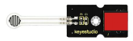
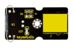
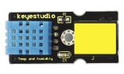
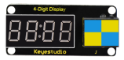
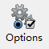
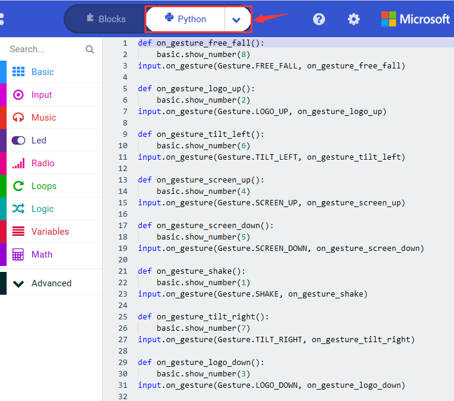
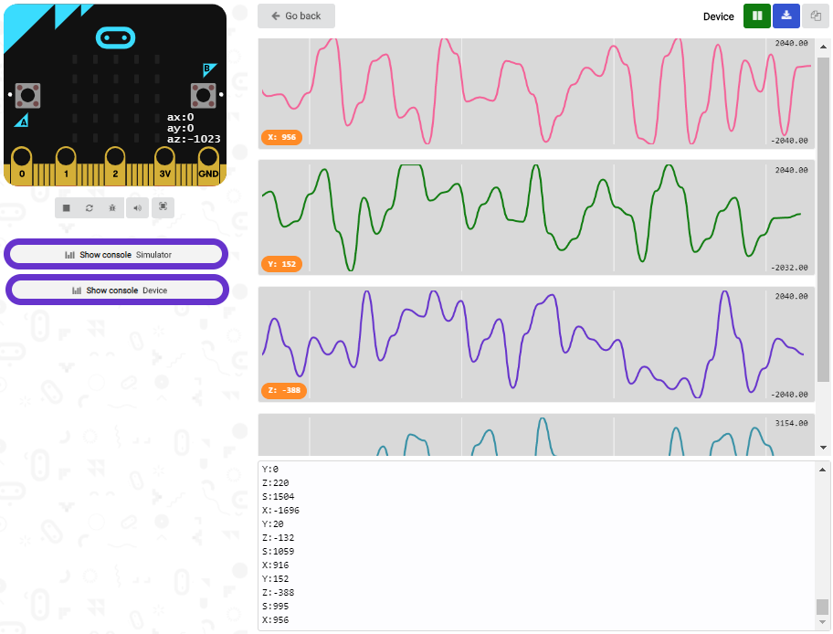
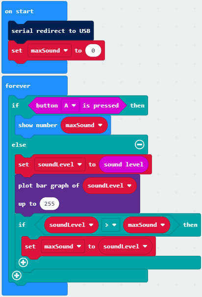
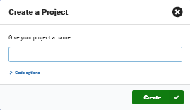

# **KS4020 KS4021 EASY PLUG Super Starter Kit for BBC Micro:bit STEM EDU**

## 1.Description

Micro:bit is significantly applied to STEM education for teenagers, as a small microcontroller, which features small in size, easy to carry, and powerful function. At present, innovative technology products, like robots, wearable devices and interactive electronic games can be produced by programming and code.

[MakeCode](https://makecode.com/) is a framework for creating interactive and engaging programming experiences for those new to the world of programming. The platform provides the foundation for a tailored coding experience to create and run user programs on actual hardware or in a simulated target.

To make you deeply know the micro:bit, we also provide test code and projects.

This super starter kit incorporates different sensors and modules such as passive buzzer, 1602 LCD module, RGB, crash sensor and so on. The detailed projects, from simple to difficult will spur your inspiration and bring in the magical programming world.

## 2.Kit List

Micro:bit board is Not Included in KS4020 Kit

| #    | Component                                       | Quantity | Picture                                   |
| ---- | ----------------------------------------------- | -------- | ----------------------------------------- |
| 0    | Micro:bit board is Included in KS4021 Kit       | 1        |   |
| 1    | EASY Plug Shield for Micro bit V1.1             | 1        |                   |
| 2    | EASY Plug While LED Module                      | 1        |                   |
| 3    | EASYP Plug Blue LED Module                      | 1        |                   |
| 4    | EASY Plug Red LED Module                        | 1        |                   |
| 5    | EASY Plug thin-film Pressure Sensor             | 1        |                   |
| 6    | EASY Plug Analog Sound Sensor                   | 1        |                   |
| 7    | EASY plug Water Level Sensor                    | 1        |                   |
| 8    | EASY plug Potentiometer Sensor                  | 1        |                   |
| 9    | EASY Plug Analog Alcohol Sensor                 | 1        |                  |
| 10   | EASY Plug LM35 Temperature Sensor Module        | 1        |                  |
| 11   | EASY Plug Digital Tilt Sensor Module            | 1        |                  |
| 12   | EASY plug Steam Sensor                          | 1        |  |
| 13   | EASY Plug Hall Magnetic Sensor                  | 1        |                  |
| 14   | EASY Plug Crash Sensor                          | 1        |                  |
| 15   | EASY Plug Digital Push Button                   | 1        |                  |
| 16   | EASY Plug Reed Switch Module                    | 1        |                  |
| 17   | EASY Plug Line Tracking Sensor                  | 1        |                  |
| 18   | EASY Plug Photo Interrupter Module              | 1        |                  |
| 19   | EASY Plug Single Relay Module                   | 1        |                  |
| 20   | EASY plug DHT11 Temperature and Humidity Sensor | 1        |                  |
| 21   | EASY Plug 1602 LCD Module                       | 1        |                  |
| 22   | EASY Plug 4-digit LED Display                   | 1        |                  |
| 23   | 200mm Blue RJ11 Cable                           | 5        |                  |
| 24   | 300mm Blue RJ11 Cable                           | 3        |                  |
| 25   | Micro USB cable                                 | 1        |                  |
|      | 6-Slot AA Battery Holder                        | 1        |                  |
|      | 1.5V AA Battery(not included)                   | 6        |  |

## 3.Introduction to Micro:bit V2.0

 **What is Micro:bit?**

Designed by BBC, Micro:bit main board aims to help children aged above 10 years old to have a better learning of programming.

It is equipped with loads of components,including a 5*5 LED dot matrix, 2 programmable buttons, a compass, a Micro USB interface and a Bluetooth module and others. Though it is just the size of a credit card, it boasts multiple functions. To name just a few, it can be applied in programming video games, making interactions between light and sound, controlling a robot, conducting scientific experiments, developing wearable devices and make some cool inventions like robots and musical instruments, basically everything imaginable.

The latest version, that’s version 2.0, of Micro:bit main board has a touch-sensitive logo and a MEMS microphone. And there is a buzzer built in the other side of the board which makes playing all kinds of sound possible without any external equipment. The golden fingers and gears added provide a better fixing of crocodile clips. Moreover, this board has a sleeping mode to lower the power consumption of battery and it can be entered if users long press the Reset & Power button on the back of it. More importantly, the CPU capacity of this version is much better than that of the V1.5 and the V2 has more RMA. 

In final analysis, the Micro:bit main board V2 can allow customers to explore more functions so as to make more innovative products.

 **Comparison between V2.0 & V1.5**

 **Micro:bit main board V2.0**

 **Micro:bit main board V1.5**

**More details:**

For the Micro: Bit main board V2, pressing the Reset & Power button , it will reset the Micro: Bit and rerun the program. If you hold it tight, the red LED will slowly get darker. When the power indicator becomes darker, releasing the button and your Micro: Bit board will enter sleep mode for power saving .This will make your battery more durable. And you could press this button again to ‘wake up’ your Micro:bit.

For more information,please resort to following links：

<https://tech.microbit.org/hardware/>

https://microbit.org/new-microbit/

https://www.microbit.org/get-started/user-guide/overview/

<https://microbit.org/get-started/user-guide/features-in-depth/>

 **Pinout**

Micro:bit main board V2.0 VS V1.5

Browse the official website for more details:

<https://tech.microbit.org/hardware/edgeconnector/>

<https://microbit.org/guide/hardware/pins/>

 **Notes for the application of Micro:bit main board V2.0**

a. it is recommended to cover it with a silicone protector to prevent short circuit for it has a lot of sophisticated electronic components.

b. its IO port is very weak in driving since it can merely handle current less than 300mA. Therefore, do not connect it with devices operating in large current,such as servo MG995 and DC motor or it will get burnt. Furthermore, you must figure out the current requirements of the devices before you use them and it is generally recommended to use the board together with a Micro:bit shield.

c. It is recommended to power the main board via the USB interface or via the battery of 3V. The IO port of this board is 3V, so it does not support sensors of 5V. If you need to connect sensors of 5 V, a Micro: Bit expansion board is required.

d.When using pins(P3、P4、P6、P7、P10)shared with the LED dot matrix, blocking them from the matrix or the LEDs may display randomly and the 

data about sensors maybe wrong.

e.The battery port of 3V cannot be connected with battery more than 3.3V or the main board will be damaged.

f. Forbid to use it on metal products to avoid short circuit.

To put it simple, Micro:bit V2 main board is like a micro computer which has made programming at our fingertips and enhanced digital innovation. And about programming environment, BBC provides a website: https://microbit.org/code/, which has a graphical MakeCode program easy for use.

## 4.Install Micro:bit driver

If you have downloaded micro:bit driver, then no need to download it again.

If it is you first time to use micro:bit main board, then you will have to download the driver.

First of all, connect the micro:bit to your computer using a USB cable.

And enter the link https://fs.keyestudio.com/KS4021-KS4021 to download the driver file of micro:bit,
.

## 5.Getting Started with Micro:bit

The following instructions are applied for Windows system but can also serve as a reference if you are using a different system.

### 5.1 Write code and program

This chapter describes how to write program with the App Micro: Bit and load the program to the Micro: Bit main board V2.

You are recommended to browse the official website of Micro:bit for more details, and the link is attached below:

[https://microbit.org/guide/quick/](Https://microbit.org/guide/quick/)  

Step 1: connect the Micro: Bit main board V2 with your computer 

Firstly, link the Micro: Bit main board V2 with your computer via the USB cable.Macs、PCs、 Chromebooks and Linux （including Raspberry Pi）systems are all compatible with the Micro: Bit main board V2.

Note that if you are about to pair the board with your phone or tablet, please refer to this link:

https://microbit.org/get-started/user-guide/mobile/

Secondly, if the red LED on the back of the board is on, that means the board is powered. Then Micro: Bit main board V2 will appear on your computer as a driver named 'MICROBIT'. Please note that it is not an ordinary USB disk as shown below.

Step 2: writing programs

View the link https://makecode.microbit.org/ in your browser;

Click ‘New Project’;

The dialog box‘Create a Project’ appears, fill it with ‘heartbeat’ and click ‘Create √’ to edit.

(If you are running Windows 10 system, it is also viable to edit on the APP MakeCode for micro:bit , which is exactly like editing in the website. And the link to the APP is [https://www.microsoft.com/zh-cn/p/makecode-for-micro-bit/9pjc7sv48lcx?ocid=badgep&rtc=1&activetab=pivot:overviewtab](##activetab=pivot:overviewtab) )

Write a set of micro:bit code. You can drag some modules in the Blocks to the editing area and then run your program in Simulator of MakeCode editor as shown in the picture below which demonstrates how to edit ‘heartbeat’ program . 

As for loading test code , please turn to Chapter 5.5.

And introduction of Makecode is on the next chapter 5.2.

Step 3: download test code

If your computer is Windows 10 and you have downloaded the APP MakeCode for micro:bit to write program, what you will have to do to download the program to your Micro: Bit main board V2 is merely clicking the ‘Download’ button, then all is done.

If you are writing programs through the website, following these steps:

Click the ‘Download’ in the editor to download a "hex" file, which is a compact program format that the Micro: Bit main board can read.Once the hexadecimal file is downloaded, copy it to your board V2 just like the process that you copy the file to the USB driver. If you are running Windows system, you can also right-click and select ‘Send to → Microbit (E) ‘to copy the hex file to the Micro: Bit main board V2

You can also directly drag the "hex" file onto the MICROBIT (E) disk.

During the process of copying the downloaded hex file to the Micro: Bit main board V2, the yellow signal light on the back side of the board flashes. When the copy is completed, the yellow signal light will stop flashing and remain on.

Step 4: run the program 

After the program is uploaded to the Micro: Bit main board V2, you could still power it via the USB cable or change to via an external power. The 5 x 5 LED dot matrix on the board displays the heartbeat pattern.

micro USB cable external power（3V）

Step 5：other programming languages

This chapter has described how to use the Micro: Bit main board V2.

But except for the Makecode graphical programming introduced you can also write Micro: Bit programs in other languages. Go to the link: https://microbit.org/code/ to know about other programming languages , or view the link: https://microbit.org/projects/, to find something you want to have a go.

### 5.2 Makecode：

Browse <https://makecode.microbit.org/> and enter Makecode online editor or open the APP MakeCode for micro:bit of Windows 10.

Click“New Project”, and input“heartbeat”，then enter Makecode editor, as shown below:

There are block“on start”and“forever”in the code editing area.

When the power is plugged or reset,“on start”means that blocks in the code are only executed once, “forever”implies that code will run cyclically.

### 5.3.Quick Download

As mentioned before, if your computer is Windows 10 and you have downloaded the APP MakeCode for micro:bit to write programs, the program written can be quickly downloaded to the Micro: Bit main board V2 by selecting ‘Download’.

While it is a little more trickier if you are using a browser to enter makecode. However, if you use Google Chrome, suitable for Linux，macOS and Windows 10, the process can be quicker too.

We use the webUSB function of Chrome to allow the internet page to access the hardware device connected USB.

You could refer to the following steps to connect and pair devices.

Pairing device

Connect micro:bit to your computer by USB cable. Click“...”beside“Download”and click“Pair device”.

Then click another“Pair device”as shown below.

Then select ‘’BBC micro:bit CMSIS-DPA” and click “Connect”. If ‘’BBC micro:bit CMSIS-DPA”does not show up for selection, please refer to https://makecode.microbit.org/device/usb/webusb/troubleshoot 

We also provide in the resource link.

What’s more, if you don’t know how to update the firmware of micro:bit, refer to the link: https://microbit.org/guide/firmware/ or browse folderwe provide.

Then click”Download”. The program is directly downloaded to Micro: Bit main board V2 and the sentence “Download completed!”appears.

### 5.4 Resources and test code

Tools ,test code and other resources can be downloaded via the link [https://fs.keyestudio.com/KS4020-4021](https://fs.keyestudio.com/KS4005-4006)

Download and unzip the file, you will see a file clip named KS4020（KS4021） Keyestudio EASY PLUG Super Starter Kit For BBC micro：bit STEM EDU-, and it contains following files:

### 5.5 Input test code

We provide hexadecimal code files (project files) for each project.The file contains all the contents of the project and can be imported directly, or you can manually drag the code blocks to complete the program for each project. For simple projects, dragging a block of code to complete the program is recommended. For complex projects, it is recommended to conduct the program by importing the hexadecimal code file we provide.

Let's take the "Heatbeat" project as an example to show how to load the code.

Open the Web version of Makecode or the Windows 10 App version of Makecode.

Click “Import File”;

Select“ ../Makecode Code/Project 1\_ Heart beat/Project 1\_ Heart beat.hex” ;

Then click “Go ahead”.

In addition to importing the test code file provided into the Makecode compiler above, you can also drag the the test code file provided into the code editing area of the Makecode compiler, as shown in the figure below:

After a few seconds, it is done.

Note: if your computer system is Windows7 or 8 instead of Windows 10, the pairing cannot be done via Google Chrome. Therefore, digital signal or analog signal of sensors and modules cannot be shown on the serial port simulator. 

However, you need to read the corresponding digital signal or analog signal.So what can we do? You can use the CoolTerm software to read the serial port data of the micro:bit. Next chapter is about how to install CoolTerm.

### 5.6 CoolTerm Installation

CoolTerm program is used to read the data on serial port.

Download CoolTerm program:

<https://freeware.the-meiers.org/>

1.  After the download, we need to install CoolTerm program file, below is Window system taken as an example.
    
2.  Choose“win”to download the zip file of CoolTerm

3.  Unzip file and open it. (also suitable for Mac and Linux system)

Double-click .

The functions of each button on the Toolbar are listed below: <http://wiki.keyestudio.com/index.php/File:IDE.png>

|  | Opens up a new Terminal                          |      |
| ------------------------------------------------------------ | ------------------------------------------------ | ---- |
|  | Opens a saved Connection                         |      |
|  | Saves the current Connection to disk             |      |
|  | Opens the Serial Connection                      |      |
|  | Closes the Serial Connection                     |      |
|  | Clears the Received Data                         |      |
|  | Opens the Connection Options Dialog              |      |
|  | Displays the Terminal Data in Hexadecimal Format |      |
|  | Displays the Help Window                         |      |

## 6.Projects

(Note: project 1 to 12 will be conducted with the built-in sensors and LED dot matrix of the Micro:bit main board V2)

### Project 1: Heartbeat

 **1.Project Description**

This experiment can be conducted with a micro:bit V2 main board, a micro USB cable and a computer.

The micro:bit will display a big heart-shaped image then a smaller one.

That is so-called a heartbeat image.

 **2.Components Needed:**

-   Micro:bit main board V2 \*1

-   Micro USB cable\*1

 **3.Test Code:**

Attach the Micro:bit main board V2 to your computer via the Micro USB cable and begin editing.

Firstly, click”basic”module and find and drag the block “show icon  “ to module “forever”;

Secondly, click”basic”module again and find and drag the block “show icon  “ to module “forever”and click the little triangle to select “show icon ”;

Thirdly, click”basic”module and find and drag the block””to the code block and click the littler triangle to select 500;

**Complete Program：**

**Note: the “on start”means that blocks in the code are only executed once, “forever”implies that code will run cyclically.**

Click “JS JavaScript”, you will find the corresponding programming languages.

Click the little triangle“of JS JavaScript”to choose“Python”, you will find the corresponding Python programming languages.

 **4.Test Results:**

Upload test code to micro:bit V2 and keep the computer and micro:bit board connected, Then the LED dot matrix shows pattern“”and “”alternatively. 

( Please refer to chapter 5.3 to know how to download test code quickly.)

If the downloading is not smooth, please remove the micro USB from the main board and then reconnect them and reopen Makecode to try again.

### Project 2: Light Up A Single LED

 **1.Project Description:**

The LED dot matrix consists of 25 LEDs arranged in a 5 by 5 square. In order to locate these LEDs quickly, as the figure shown below, we can regard this matrix as a coordinate system and create two aces by marking those in rows from 0 to 4 from top to bottom, and the ones in columns from 0 to 4 from the left to the right. 

Therefore, the LED sat in the second of the first line is (1,0)and the LED positioned in the fifth of the fourth column is (3,4)and others likewise.

 **2.Components Needed:**

-   Micro:bit main board V2 \*1

-   Micro USB cable\*1

 **3.Test Code:**

Attach the Micro:bit main board V2 to your computer via the Micro USB cable and begin editing.

Firstly, click”Led”module and then the”more”module to find and drag the block “led enable false “ to block“on start”; click the little triangle of “led enable false “ to select”true”;

Secondly, click”Led”module and to find and drag the block “toggle x 0 y 0“ to block“forever”and alter “x0” to”x1”;

Thirdly, click”Basic”module to find and drag the block”pause(ms)100”to“forever” block and set pause to 500;

Fourthly, copy the block  and place it into forever” block;

Fifthly, click”Led”module to find and drag the block”plot x 0 y 0”to “forever” block and change the “x 0 y 0” to “x 3 y 4”;

Sixthly, copy the block“pause(ms)500”and place it into forever” block;

Lastly, click”Led”module to find and drag the block”unplot x 0 y 0”to “forever”block and change“x 0 y 0”to“x 3 y 4”;and copy and place the block“pause(ms)500”to block“forever”;

**Complete Program：**

Click “JS JavaScript”, you will find the corresponding programming languages.

Click the little triangle”of JS JavaScript”to choose“Python”, you will find the corresponding Python programming languages.

 **4.Test Results**

Uploading test code to micro:bit V2 and power on it via the USB cable. The LED at (1,0) flashes for 0.5s and the one at (3,4) flashes for 0.5s

### Project 3: LED Dot Matrix

 **1.Project Description:**

Dot matrices are very commonplace in daily life. They are founded in LED advertisement screens, elevator floor displays, bus stops and so on.

The LED dot matrix of micro: bit V2 contains 25 LEDs in a grid. Previously, we have succeeded in controlling a certain LED on and off by integrating its position value into the test code. By the same theory, we can turn on many LEDs at the same time to showcase patterns, digits and characters. 

 **2.Components Needed:**

-   Micro:bit main board V2 \*1

-   Micro USB cable\*1

 **3.Test Code 1：**

Link computer with micro:bit board by micro USB cable, and program in MakeCode editor.

Enter“Led”→“more”→“led enable false”

Click the drop-down triangle button to select“true”

Combine it with “on start” block

\*\*\*\*\*\*\*\*\*\*\*\*\*\*\*\*\*\*\*\*\*\*\*\*\*\*\*\*\*\*\*\*\*\*\*\*\*\*\*\*\*\*\*\*\*\*\*\*\*\*\*\*\*\*\*\*\*\*\*\*\*\*\*\*\*

Click“Led”to move“plot x 0 y 0”into“forever”，then replicate“plot x 0 y 0”for 8 times, respectively set to“x 2”y 0”,“x 2”y 1”,“x 2”y 2”,“x 2”y 3”,“x 2”y 4”,“x 1”y 3”“x 0”y 2”,“x 3”y 3”,“x 4”y 2”.

Complete Program：

Select“JavaScript" and“Python”to switch into JavaScript and Python language code:

 **4.Test Results 1：**

Upload code 1 , we will see the  icon

 **5.Test Code 2：**

Link computer with micro:bit board by micro USB cable, and program in MakeCode editor.

Enter“Basic”→“show number 0”block,

Duplicate it for 4 times, then separately set to“show number 1”,“show number 2”,“show number 3”,“show number 4”,“show number 5”.

\*\*\*\*\*\*\*\*\*\*\*\*\*\*\*\*\*\*\*\*\*\*\*\*\*\*\*\*\*\*\*\*\*\*\*\*\*\*\*\*\*\*\*\*\*\*\*\*\*\*\*\*\*\*\*\*\*\*\*\*\*\*\*\*\*

Click“Basic”→“show leds”, then put it into“forever”block，tick blue boxes to light LED and generate“↓”pattern.

\*\*\*\*\*\*\*\*\*\*\*\*\*\*\*\*\*\*\*\*\*\*\*\*\*\*\*\*\*\*\*\*\*\*\*\*\*\*\*\*\*\*\*\*\*\*\*\*\*\*\*\*\*\*\*\*\*\*\*\*\*\*\*\*\*

Move out the block“show string” from“Basic”block, and leave it beneath the“show leds” block

Choose“show icon”from“Basic”block, and leave it beneath the block“show string“Hello!”block

\*\*\*\*\*\*\*\*\*\*\*\*\*\*\*\*\*\*\*\*\*\*\*\*\*\*\*\*\*\*\*\*\*\*\*\*\*\*\*\*\*\*\*\*\*\*\*\*\*\*\*\*\*\*\*\*\*\*\*\*\*\*\*\*\*

A. Enter“Basic”→“show arrow North”;

B. Leave it into“forever”block，replicate“show arrow North”for 3 times，respectively set to“North East”,“South East”, “South West”,“North West”.

Click“Basic”to get block“clear screen”then remain it below the block “show arrow North West”

\*\*\*\*\*\*\*\*\*\*\*\*\*\*\*\*\*\*\*\*\*\*\*\*\*\*\*\*\*\*\*\*\*\*\*\*\*\*\*\*\*\*\*\*\*\*\*\*\*\*\*\*\*\*\*\*\*\*\*\*\*\*\*\*\*

Drag“pause (ms) 100”block from“Basic”block and set to 500ms, then leave it below“clear screen”block.

Complete Program:

Select“JavaScript" and“Python”to switch into JavaScript and Python language code:

 **6.Test Results 2：**

Upload code 2 and plug the micro:bit to a computer. The micro: bit starts showing number 1, 2, 3, 4, and 5, then cyclically display,“Hello!”,  ,  , ,  and patterns.

### Project 4: Programmable Buttons

 **1.Project Description:**

Buttons can be used to control circuits. In an integrated circuit with a button, the circuit is controlled by the button.

Micro: Bit main board V2 boasts three buttons, two programmable buttons(A and B), and the one on the other side is a reset button. By pressing the two buttons, three different signals can be output. 

The micro:bit will show A, B and AB if you press button A, B and AB respectively.

Let’s get started.

 **2.Components Needed:**

-   Micro:bit main board V2 \*1

-   Micro USB cable\*1

 **3.Test Code 1：**

Link computer with micro:bit board by micro USB cable, and program in MakeCode editor,

Delete“on start”and“forever”firstly，then click“Input”→“on button A pressed”

\*\*\*\*\*\*\*\*\*\*\*\*\*\*\*\*\*\*\*\*\*\*\*\*\*\*\*\*\*\*\*\*\*\*\*\*\*\*\*\*\*\*\*\*\*\*\*\*\*\*\*\*\*\*\*\*\*\*\*\*\*\*\*\*\*

A. Click“Basic”→“show string”;

B. Then place it into“on button A pressed”block, change “Hello!”into“A”.

Copy code stringonce, tap the drop-down button“A”to select“B”and modify character“A”into“B”.

\*\*\*\*\*\*\*\*\*\*\*\*\*\*\*\*\*\*\*\*\*\*\*\*\*\*\*\*\*\*\*\*\*\*\*\*\*\*\*\*\*\*\*\*\*\*\*\*\*\*\*\*\*\*\*\*\*\*\*\*\*\*\*\*\*

Copyonce，and set to“on button A+B pressed”and“show string “AB”

\*\*\*\*\*\*\*\*\*\*\*\*\*\*\*\*\*\*\*\*\*\*\*\*\*\*\*\*\*\*\*\*\*\*\*\*\*\*\*\*\*\*\*\*\*\*\*\*\*\*\*\*\*\*\*\*\*\*\*\*\*\*\*\*\*

**Complete Code:**

Select“JavaScript" and“Python”to switch into JavaScript and Python language code:

 **4.Test Results 1：**

Upload the test code 1 to micro:bit main board V2. Then the 5\*5 LED dot matrix
will show A, B and AB if button A and B pressed together.

 **5.Test Code 2：**

A. Click“Led”→“more”→“led enable false”,

B. Put it into the block“on start”，click drop-down triangle button to select“true” .

\*\*\*\*\*\*\*\*\*\*\*\*\*\*\*\*\*\*\*\*\*\*\*\*\*\*\*\*\*\*\*\*\*\*\*\*\*\*\*\*\*\*\*\*\*\*\*\*\*\*\*\*\*\*\*\*\*\*\*\*\*\*\*\*\*

A. Tap“Variables”→“Make a Variable...”→“New variable name：”

B. Enter“item”in the dialog box and click“OK”，then variable“item”is produced. And move“set item to 0”into“on start”block

\*\*\*\*\*\*\*\*\*\*\*\*\*\*\*\*\*\*\*\*\*\*\*\*\*\*\*\*\*\*\*\*\*\*\*\*\*\*\*\*\*\*\*\*\*\*\*\*\*\*\*\*\*\*\*\*\*\*\*\*\*\*\*\*\*

A. Click“Input”→“on button A pressed”.

B. Go to“Variables”→“ change item by 1 ”

C. Place it into“on button A pressed”and 1 is modified into 5.

\*\*\*\*\*\*\*\*\*\*\*\*\*\*\*\*\*\*\*\*\*\*\*\*\*\*\*\*\*\*\*\*\*\*\*\*\*\*\*\*\*\*\*\*\*\*\*\*\*\*\*\*\*\*\*\*\*\*\*\*\*\*\*\*\*

Duplicatecode string once，click the drop-down button to select“B”，then set“change item by -5”.

\*\*\*\*\*\*\*\*\*\*\*\*\*\*\*\*\*\*\*\*\*\*\*\*\*\*\*\*\*\*\*\*\*\*\*\*\*\*\*\*\*\*\*\*\*\*\*\*\*\*\*\*\*\*\*\*\*\*\*\*\*\*\*\*\*

A. Enter“Led”→“plot bar graph of 0 up to 0”

B. Keep it into“forever”block

C. Go to“Variables”to move“item”into 0 box，change 0 into 25.

\*\*\*\*\*\*\*\*\*\*\*\*\*\*\*\*\*\*\*\*\*\*\*\*\*\*\*\*\*\*\*\*\*\*\*\*\*\*\*\*\*\*\*\*\*\*\*\*\*\*\*\*\*\*\*\*\*\*\*\*\*\*\*\*\*

A. Go to“Logic”to move out “if...true...then...”and “=”blocks，

B. Keep“=”into“true”box and set to “\>”

C. Select“item”in the“Variables”and lay it down at left box of “\>”，change 0 into 25；

D. Enter“Variables”to drag“set item to 0”block into“if...true..then...”, alter 0 into 25.

\*\*\*\*\*\*\*\*\*\*\*\*\*\*\*\*\*\*\*\*\*\*\*\*\*\*\*\*\*\*\*\*\*\*\*\*\*\*\*\*\*\*\*\*\*\*\*\*\*\*\*\*\*\*\*\*\*\*\*\*\*\*\*\*\*

A. Replicate code stringonce

B.“\>” is modified into “\<” and 25 is changed into 0,

C. Leave it beneath code string.

**Complete Program：**

Select“JavaScript" and“Python”to switch into JavaScript and Python language code:

 **6.Test Results 2：**

Uploading test code 2 to micro:bit main board V2. A row of lights are turned on when you press button A, B the LEDs turning red reduce.

### Project 5: Temperature Detection

 **Project Description:**

Actually, the micro:bit V2 is not equipped with a temperature sensor, but uses the built-in NFR52833 chip for temperature detection. Therefore, the detected temperature should be closer to the chip.

 **1.Components Needed:**

-   Micro:bit main board V2 \*1

-   Micro USB cable\*

 **2.Test Code 1：**

Click“Advanced”→”Serial”→“serial redirect to USB”into“on start”

\*\*\*\*\*\*\*\*\*\*\*\*\*\*\*\*\*\*\*\*\*\*\*\*\*\*\*\*\*\*\*\*\*\*\*\*\*\*\*\*\*\*\*\*\*\*\*\*\*\*\*\*\*\*\*\*\*\*\*\*\*\*\*\*\*

Go to“Serial”→“serial write value“x”=0”into“forever”

Click“Input”→ “temperature(℃)”into“into serial write value“x”=0 and change”0”into “temperature”

\*\*\*\*\*\*\*\*\*\*\*\*\*\*\*\*\*\*\*\*\*\*\*\*\*\*\*\*\*\*\*\*\*\*\*\*\*\*\*\*\*\*\*\*\*\*\*\*\*\*\*\*\*\*\*\*\*\*\*\*\*\*\*\*\*

Go to“Basic”→“pause (ms) 100”into“forever”and set pause to 500

\*\*\*\*\*\*\*\*\*\*\*\*\*\*\*\*\*\*\*\*\*\*\*\*\*\*\*\*\*\*\*\*\*\*\*\*\*\*\*\*\*\*\*\*\*\*\*\*\*\*\*\*\*\*\*\*\*\*\*\*\*\*\*\*\*

**Complete Program：**

Select“JavaScript" and“Python”to switch into JavaScript and Python language code:

 **3.Test Results 1：**

Upload test code 1 to micro:bit V2, attach it to a computer and click“Show console Device”. Then the data of temperature is displayed in the serial monitor page as shown below.

Only on Windows 10 can Google Chrome match with devices. If you use other Windows systems, the CoolTerm serial monitor is best choice for reading data.

Open CoolTerm software, click Options, select SerialPort, set COM port and baud rate to 115200 (after testing, the baud rate of USB SerialPort communication on Micro:bit V2 is 115200), click OK, and Connect.

Then the CoolTerm serial monitor shows the change of temperature value in the current environment, as shown in the figures below :

 **4.Test Code 2：**

Link computer with micro:bit board by micro USB cable, and program in MakeCode editor,

A. Go to“Led”→“more”→“led enable false”block,

B. Keep it into the“on start”block，tap the triangle button to select“true”.

\*\*\*\*\*\*\*\*\*\*\*\*\*\*\*\*\*\*\*\*\*\*\*\*\*\*\*\*\*\*\*\*\*\*\*\*\*\*\*\*\*\*\*\*\*\*\*\*\*\*\*\*\*\*\*\*\*\*\*\*\*\*\*\*\*

Tap“Logic”and drag“if...then...else”into“forever”block; and then drag “=” into “true”

Enter“Input”to move“temperature(℃)”into the left side of “=”; click the little triangle of “=”to choose “≥”,and change the “0”to “35”

Click“Basic”to find out block“show icon”and move it into“then”; copy and place the block“show icon”to “else”and click the little triangle of ”to select “”

Complete Program：

Select“JavaScript" and“Python”to switch into JavaScript and Python language code:

 **5.Test Results 2：**

Upload the code 2. When the ambient temperature is less than 35℃, 5\*5 LED will show. When the temperature is equivalent to or greater than 35℃, the image will appear.

### Project 6: Geomagnetic Sensor

 **1.Project Description:**

This project aims to explain the use of the micro: bit geomagnetic sensor, which can not only detect the strength of the geomagnetic field, but also be used as a compass to find bearings. It is also an important part of the navigation attitude reference system (AHRS). 

Micro: Bit main board V2 uses LSM303AGR geomagnetic sensor, and the dynamic range of magnetic field is ±50 gauss. In the board, the magnetometer module is used in both magnetic detection and compass. In this experiment, the compass will be introduced first, and then the original data of the magnetometer will be checked. 

The main component of a common compass is a magnetic needle, which can be rotated by the geomagnetic field and point toward the geomagnetic North Pole (which is near the geographic South Pole) to determine direction.

 **2.Components Needed:**

-   Micro:bit main board V2 \*1

-   Micro USB cable\*1

 **3.Test Code 1：**

Link computer with micro:bit board by micro USB cable, and program in MakeCode editor.

A. Click“Input”→“more”→“calibrate compass”

B. Lay down it into block“on start”.

A. Go to“Input”→“on button A pressed”.

B. Enter“Basic”→“show number”, put it into“on button A pressed”block;

C. Tap“Input”→“compass heading(℃)”， and place it into“show number”

\*\*\*\*\*\*\*\*\*\*\*\*\*\*\*\*\*\*\*\*\*\*\*\*\*\*\*\*\*\*\*\*\*\*\*\*\*\*\*\*\*\*\*\*\*\*\*\*\*\*\*\*\*\*\*\*\*\*\*\*\*\*\*\*\*

Complete Program：

Select“JavaScript" and“Python”to switch into JavaScript and Python language code:

 **4.Test Results 1：**

Upload test code to micro:bit V2, plug it to a power, and press the button A. The board will send request to calibrate compass and show“TILT TO FILL SCREEN”; then enter the calibration page.

Rotate the board until all 25 LEDs are fully on, as shown below.

After that, a smile pattern  appears, which implies that the calibration is done. When the calibration process is completed, the reading value will be displayed if you press the button A.

And the direction north, east, south and west correspond to 0°, 90°, 180° and 270°.

 **5.Test Code 2：**

This module can keep readings and determine direction

For the above picture, the arrow pointing to the upper left when the value ranges from 292.5 to 337.5.

0.5 can’t be input in the code, thereby, the values we get are 293 and 338.

Link computer with micro:bit board by micro USB cable, and program in MakeCode editor,

1.  Enter“Input”→ “more”→“calibrate compass”

2.  Move“calibrate compass”into“on start”

\*\*\*\*\*\*\*\*\*\*\*\*\*\*\*\*\*\*\*\*\*\*\*\*\*\*\*\*\*\*\*\*\*\*\*\*\*\*\*\*\*\*\*\*\*\*\*\*\*\*\*\*\*\*\*\*\*\*\*\*\*\*\*\*\*

A. Click“Variables”→“Make a Variable...”→“New variable name：”

B. Input“x”in the blank box and click“OK”, and the variable “x” is generated.

C. Drag out“set x to”into“forever”block

A. Go to“Input”→“compass heading(℃)”, and keep it into“0”box

Tap“Logic”→“if...then...else”, leave it below block“sex x to compass heading”, then clickicon for 6 times.

\*\*\*\*\*\*\*\*\*\*\*\*\*\*\*\*\*\*\*\*\*\*\*\*\*\*\*\*\*\*\*\*\*\*\*\*\*\*\*\*\*\*\*\*\*\*\*\*\*\*\*\*\*\*\*\*\*\*\*\*\*\*\*\*\*

A. Place“and”into“true”block

B. Then move“=”block to the left box of “and”

C. Click“Variables”to drag“x”to the left “0”box, change 0 into 293 and set to “≥”;

D. Then copy“x≥293”once and leave it to the right “0”box and set to“x\<338”

\*\*\*\*\*\*\*\*\*\*\*\*\*\*\*\*\*\*\*\*\*\*\*\*\*\*\*\*\*\*\*\*\*\*\*\*\*\*\*\*\*\*\*\*\*\*\*\*\*\*\*\*\*\*\*\*\*\*\*\*\*\*\*\*\*

A. Go to“Basic”→“show leds”

B. Lay it down beneath block, then click“show leds”and the pattern appears.

A. Duplicate for 6 times.

B. Separately leave them into the blank boxes behind “else if”.

C. Set to“x≥23 and x\<68”,“x≥68 and x\<113 ”,“x≥113 and x\<158 ”,“x≥158 and x\<203 ”,“x≥203 and x\<248 ”,“x≥248 and x\<293 ”respectively.

D. Then copy “show leds”for 7 times and keep them below the “else if.......then” block respectively.

E. Click the blue boxes to form the pattern“, “”, “, “” “”, “”and “”.

\*\*\*\*\*\*\*\*\*\*\*\*\*\*\*\*\*\*\*\*\*\*\*\*\*\*\*\*\*\*\*\*\*\*\*\*\*\*\*\*\*\*\*\*\*\*\*\*\*\*\*\*\*\*\*\*\*\*\*\*\*\*\*\*\*\*\*\*\*\*\*\*\*\*\*\*\*

**Complete Program：**

|  |  |
| ------------------------------------------------------------ | ------------------------------------------------------------ |
|  |  |

Select“JavaScript" and“Python”to switch into JavaScript and Python language code:

 **6.Test Results 2**

Upload code 2 and plug the micro:bit to a power. After calibrating and tilting the micro:bit V2, the LED dot matrix will display the direction signs.

### Project 7: Accelerometer

 **1.Project Description:**

The Micro: bit V2 has a built-in LSM303AGR gravity acceleration sensor, also known as accelerometer, with a resolution of 8/10/12 bits. The code section sets the range to 1g, 2g, 4g, and 8g.

We often use accelerometer to detect the status of machines.

In this project, we will introduce how to measure the position of the board with the accelerometer. And then have a look at the original three-axis data output by the accelerometer.

 **2.Components Needed:**

-   Micro:bit main board V2 \*1

-   Micro USB cable\*1

 **3.Test Code 1：**

Link computer with micro:bit board by micro USB cable, and program in MakeCode editor,

(1) A. Enter“Input”→“on shake”，

B. Click“Basic”→“show number”, place it into“on shake”block, then change 0 into 1.

\*\*\*\*\*\*\*\*\*\*\*\*\*\*\*\*\*\*\*\*\*\*\*\*\*\*\*\*\*\*\*\*\*\*\*\*\*\*\*\*\*\*\*\*\*\*\*\*\*\*\*\*\*\*\*\*\*\*\*\*\*\*\*\*\*

(2) A. Copy code string for 7 times;

separately click the triangle button to select“logo up”,“logo down”,“screen up”,“screen down”,“tilt left”,“tilt right”and“free fall”, then respectively change 1 into 2, 3, 4, 5, 6, 7, 8.

\*\*\*\*\*\*\*\*\*\*\*\*\*\*\*\*\*\*\*\*\*\*\*\*\*\*\*\*\*\*\*\*\*\*\*\*\*\*\*\*\*\*\*\*\*\*\*\*\*\*\*\*\*\*\*\*\*\*\*\*\*\*\*\*\*

**Complete Program：**

|  |  |
| ------------------------------------------------------------ | ------------------------------------------------------------ |
|  |  |

Select“JavaScript" and“Python”to switch into JavaScript and Python language code:

 **4.Test Results 1:**

Uploading the test code 1 to micro:bit V2 and powering it on via the USB cable. If we shake the micro: bit V2. the LED dot matrix will display “1”.

When it is kept upright（its logo above the LED dot matrix）, the number 2 will show.

When it is kept upside down( its logo below the LED dot matrix) , it will show as below.

When it is placed still on the desk, showing its front side, the number 4
appears.

When it is placed still on the desk, showing its back side, the number 5 will exhibit.

When the board is tilted to the left , the LED dot matrix shows the number 6 as shown below.

When the board is tilted to the right , the LED dot matrix displays the number 7 as shown below

When the board is knocked to the floor, this process can be considered as a free fall and the LED dot matrix shows the number 8. (please note that this test is not recommended for it may damage the main board.)

Attention: if you’d like to try this function, you can also set the acceleration to 3g, 6g or 8g. But still ,we don not recommend.

 **5.Test Code 2：**

A. Go to“Advanced”→“Serial”→“serial redirect to USB”

B. Drag it into“on start”

\*\*\*\*\*\*\*\*\*\*\*\*\*\*\*\*\*\*\*\*\*\*\*\*\*\*\*\*\*\*\*\*\*\*\*\*\*\*\*\*\*\*\*\*\*\*\*\*\*\*\*\*\*\*\*\*\*\*\*\*\*\*\*\*\*

A. Enter“Serial”→“serial write value x =0”

B. Leave it into“forever”block

\*\*\*\*\*\*\*\*\*\*\*\*\*\*\*\*\*\*\*\*\*\*\*\*\*\*\*\*\*\*\*\*\*\*\*\*\*\*\*\*\*\*\*\*\*\*\*\*\*\*\*\*\*\*\*\*\*\*\*\*\*\*\*\*\*

A. Click“Input”→“acceleration(mg) x”；

B. Keep it into“0”box and capitalize the“x”

\*\*\*\*\*\*\*\*\*\*\*\*\*\*\*\*\*\*\*\*\*\*\*\*\*\*\*\*\*\*\*\*\*\*\*\*\*\*\*\*\*\*\*\*\*\*\*\*\*\*\*\*\*\*\*\*\*\*\*\*\*\*\*\*\*

Go to“Basic”and move out“pause (ms) 100”below the block, then set to 100ms.

\*\*\*\*\*\*\*\*\*\*\*\*\*\*\*\*\*\*\*\*\*\*\*\*\*\*\*\*\*\*\*\*\*\*\*\*\*\*\*\*\*\*\*\*\*\*\*\*\*\*\*\*\*\*\*\*\*\*\*\*\*\*\*\*\*

Replicate code string for 3 times and keep them into“forever”block，separately set the whole code string as follows:

**Complete Program：**

|  |  |
| ------------------------------------------------------------ | ------------------------------------------------------------ |
|                                                              |                                                              |

Select“JavaScript" and“Python”to switch into JavaScript and Python language code:

 **6.Test Results 2**

Upload test code to micro:bit main board V2, power the main board via the USB cable, and click“Show console Device”.

After referring to the MMA8653FC data manual and the hardware schematic diagram of the Micro: bit main board V2, the accelerometer coordinate of the Micro: bit V2 motherboard are shown in the figure below:

The following interface shows the decomposition value of acceleration in X axis, Y axis and Z axis respectively, as well as acceleration synthesis (acceleration synthesis of gravity and other external forces).

If you're running Windows 7 or 8 instead of Windows 10, via Google Chrome won't be able to match devices. You'll need to use the CoolTerm serial monitor software to read data.

You could open CoolTerm software, click Options, select SerialPort, set COM port and baud rate to 115200 (after testing, the baud rate of USB SerialPort communication on Micro: Bit main board V2 is 115200), click OK, and Connect. The CoolTerm serial monitor shows the data of X axis, Y axis and Z axis , as shown in the figures below :

### Project 8: Light Detection

 **1.Project Description:**

In this project, we focus on the light detection function of the Micro: Bit mainboard V2. It is achieved by the LED dot matrix. And it  can be viewed as a photosensor.

 **2.Components Needed:**

-   Micro:bit main board V2 \*1

-   Micro USB cable\*1

 **3.Test Code：**

Link computer with micro:bit board by micro USB cable, and program in MakeCode editor,

(1)A. Enter“Advanced”→“Serial”→“serial redirect to USB”;

B. Drag it into“on start”block.

\*\*\*\*\*\*\*\*\*\*\*\*\*\*\*\*\*\*\*\*\*\*\*\*\*\*\*\*\*\*\*\*\*\*\*\*\*\*\*\*\*\*\*\*\*\*\*\*\*\*\*\*\*\*\*\*\*\*\*\*\*\*\*\*\*

(2) A. Go to“Serial”→“serial write value x =0”;

B. Move it into“forever”

1.  A. Click“Input”→“acceleration(mg) x”

B. Put“acceleration(mg) x”in the“0”box and change “x”into“Light intensity”.

\*\*\*\*\*\*\*\*\*\*\*\*\*\*\*\*\*\*\*\*\*\*\*\*\*\*\*\*\*\*\*\*\*\*\*\*\*\*\*\*\*\*\*\*\*\*\*\*\*\*\*\*\*\*\*\*\*\*\*\*\*\*\*\*\*

1.  A. Click“Basic”→“pause (ms) 100”;

B. Lay it down into“forever”and set to 100ms.

\*\*\*\*\*\*\*\*\*\*\*\*\*\*\*\*\*\*\*\*\*\*\*\*\*\*\*\*\*\*\*\*\*\*\*\*\*\*\*\*\*\*\*\*\*\*\*\*\*\*\*\*\*\*\*\*\*\*\*\*\*\*\*\*\*

**Complete Program：**

|  |  |
| ------------------------------------------------------------ | ------------------------------------------------------------ |
|                                                              |                                                              |

Select“JavaScript" and“Python”to switch into JavaScript and Python language code:

 **4.Test Results:**

Upload the test code to micro:bit main board V2, power the board via the USB cable and click“Show console Device”.

When the LED dot matrix is covered by hand, the light intensity showed is approximately 0; when the LED dot matrix is exposed to light,the light intensity displayed gets stronger with the light as shown below.

The 20 in the code is an arbitrary value of light intensity. If the current light level is less than or equal to 20, the moon will appear on the LED dot matrix. If it's bigger than 20, the sun will appear.

If you're running Windows 7 or 8 instead of Windows 10, via Google Chrome won't be able to match devices. You'll need to use the CoolTerm serial monitor software to read data.

You could open CoolTerm software, click Options, select SerialPort, set COM port and baud rate to 115200 (after testing, the baud rate of USB SerialPort communication on Micro: Bit main board V2 is 115200), click OK, and  Connect. The CoolTerm serial monitor shows the value of light intensity , as shown in the figures below :

### Project 9: Speaker

 **1.Project Description:**

The Micro: bit main board V2 has an built-in speaker, which makes adding sound to the programs easier. We can program the speaker to air all kinds of tones .

 **2.Components Needed:**

-   Micro:bit main board V2 \*1

-   Micro USB cable\*1

 **3.Test Code：**

Link computer with micro:bit board by micro USB cable, and program in MakeCode editor,

(1) Enter“Basic”module to find “show icon”and drag it into “on start”block;

Click the little triangle to find “”

\*\*\*\*\*\*\*\*\*\*\*\*\*\*\*\*\*\*\*\*\*\*\*\*\*\*\*\*\*\*\*\*\*\*\*\*\*\*\*\*\*\*\*\*\*\*\*\*\*\*\*\*\*\*\*\*\*\*\*\*\*\*\*\*\*

(2) Enter“Music”module to find and drug“play sound giggle until done” into“forever”block;

Enter“Basic”module to find and drug“pause(ms) 100”into“forever”block ;

Change 100 into 1000;

(3) Copy  three times and place it into “forever” block ;

Click the little triangle to select “happy”,”hello”,”yawn”;

\*\*\*\*\*\*\*\*\*\*\*\*\*\*\*\*\*\*\*\*\*\*\*\*\*\*\*\*\*\*\*\*\*\*\*\*\*\*\*\*\*\*\*\*\*\*\*\*\*\*\*\*\*\*\*\*\*\*\*\*\*\*\*\*\*

**Complete Program：**

|  |  |
| ------------------------------------------------------------ | ------------------------------------------------------------ |
|                                                              |                                                              |

Select“JavaScript" and“Python”to switch into JavaScript and Python language code:

 **4.Test Results:**

Uploading the test code to micro:bit main board V2 and powering the board via the USB cable, the speaker utters sound and the LED dot matrix shows the logo of music.

### Project 10: Touch-sensitive Logo

 **1.Project Description:**

The Micro: Bit main board V2 is equipped with a golden touch-sensitive logo, which can act as an input component and function like an extra button.

It contains a capacitive touch sensor that senses small changes in the electric field when pressed (or touched), just like your phone or tablet screen do. When you press it , you can activate the program.

 **2.Components Needed:**

-   Micro:bit main board V2 \*1

-   Micro USB cable\*1

 **3.Test Code：**

Link computer with micro:bit board by micro USB cable, and program in MakeCode editor,

Delete block“on start”and“forever”;

Enter“Input”module to find and drag“on logo pressed” ;

Click the little triangle to find “touched”’;

Enter module “Variables”→choose“Make a Variable”→input “start”→click “OK”

The variable“start”is established;

Enter“Variables”module to find and drag “set start to 0” into “on logo touched”block;

Enter“Input”module →click “more”→ find and drag“running time(ms)” into the “0”of“set start to 0”block;

Enter“Basic”module to find and drag“show icon” into “on logo touched”block;

Enter“Input”module to find and drag“on logo pressed”→choose “released”→ establish variable “time”;

Enter“Variables”module to find and drag “set time to 0”into “on logo pressed”block;

Enter“Math”module to find and drag “0-0”into the “0”of“set start to 0”block;

Enter“Input”module→ “more” → find and drag “running time(ms)” into“0”on the left side of “0-0”;

Enter“Variables”module to find and drag“start” into “0”on the right side of “0-0”;

Enter“Basic”module to find and drag“show number”into“on logo released”block;

Enter“Math”module to find and drag“square root 0” into“0”;

Click the little triangle to find”integer÷”;

Enter“Variables”module to find and drag“time” into“0”on the left side of “0-0”and change the “0”on the right side to”1000”;

**Complete Program：**

|  |  |
| ------------------------------------------------------------ | ------------------------------------------------------------ |
|                                                              |                                                              |

Select“JavaScript" and“Python”to switch into JavaScript and Python language code:

 **4.Test Results:**

Uploading the test code to micro:bit main board V2 and powering the board via the USB cable, the LED dot matrix exhibits the heart pattern when the touch-sensitive logo is pressed or touched and displays digit when the logo is released.

### Project 11: Microphone

 **1.Project Description:**

The built-in microphone of micro:bit V2 can test the sound volume  in the ambient environment. When you clap, the microphone LED indicator will be on. 

Since it can measure the intensity of sound, you can make a noise scale or disco lighting changing with music. The microphone is placed on the opposite side of the microphone LED indicator and in proximity with holes that lets sound pass. When the board detects sound, the LED indicator will light up.

 **2.Components Needed:**

-   Micro:bit main board V2 \*1

-   Micro USB cable\*1

 **3.Test Code 1：**

Link computer with micro:bit board by micro USB cable, and program in MakeCode editor,

Delete block“on start”and“forever”;

Enter“Input”module to find and drag“on loud sound”;

Enter“Basic”module to find and drag “show number”into “on loud sound”block ;

Copy  once;

Click the little triangle of “lond” to choose”quiet”;

Click the little triangle of “” to choose””;

**Complete Program：**

|  |  |
| ------------------------------------------------------------ | ------------------------------------------------------------ |
|                                                              |                                                              |

Select“JavaScript" and“Python”to switch into JavaScript and Python language code:

 **4.Test Results 1:**

Uploading test code to micro:bit main board V2 and powering the board via the USB cable. The LED dot matrix displays pattern“”when you clap; however, the image  will appear when it is quiet around.

 **5.Test Code 2:**

Link computer with micro:bit board by micro USB cable, and program in MakeCode editor,

Enter“Advanced”module→ choose“Serial”to find and drag“serial redirect to USB”into “on start”block ;

Enter“Variables”module→ choose“Make a Variable”→ input “maxSound”→click “OK”,variable ”maxSound”is established;

Enter“Variables”module to find and drag“set maxSound to 0”into “on start”block ;

Enter“Logic”module to find and drag“if true then...else”into “forever” block ;

Enter“Input”module to find and dragbutton A is pressed”into “then” ;

Enter“Basic”module to find and drag“show number”into “then” ;

Enter“Variables”module to find and drag“maxSound”into “0” ;

Establish variable“soundLevel”;

Enter“Variables”module to find and drag“set soundLevel to 0”into “else”;

Enter“Input”module to find and drag“sound level” into “0”;

Enter“Led”module to find and drag“plot bar graph of 0 up to 0” into“else”;

Enter“Variables”module to find and drag“soundLevel”into the“0”behind “of”;

Change the“0”behind“up” to“255”;

Enter“Logic”module to find and drag“if true then”into “else”block ;

Enter“Logic”module to find and drag“0 \> 0”into “then” ;

Enter“Variables”module to find and drag“soundLevel”into “0”on the left side of “0-0” ;

Enter“Variables”module to find and drag“maxSound” into “0”on the right side;

Enter“Variables”module to find and drag“set maxSound to 0”into the second“then”;

Enter“Variables”module to find and drag“soundLevel”into the“0” ;

**Complete Program：**

|  |  |
| ------------------------------------------------------------ | ------------------------------------------------------------ |
|                                                              |                                                              |

Select“JavaScript" and“Python”to switch into JavaScript and Python language code:

 **6.Test Results 2:**

Upload test code to micro:bit main board V2, power the board via the USB cable and click“Show console Device”as shown below.

When the sound is louder around, the sound value shows in the serial port is bigger as shown below.

What’s more, when pressing the button A, the LED dot matrix displays the value of the biggest volume( please note that the biggest volume can be reset via the Reset button on the other side of the board ) while when you clap, the LED dot matrix will show the pattern of the sound.

### Project 12: Bluetooth Data Reading

 **1.Project Description:**

The Micro: bit main board V2 comes with a nRF52833 processor (with built-in Bluetooth 5.1 BLE(Bluetooth Low Energy) device) and a 2.4GHz antenna for Bluetooth wireless communication and 2.4GHz wireless communication. With the help of them, the board is able to communicate with a variety of BT devices, including smart phones and tablets.

In this project, we mainly concentrate on the BT wireless communication function of this main board. Linked with BT, it can transmit code or signals. To this end, we should connect an Apple device (a phone or an iPad) to the board. 

Since setting up Android phones to achieve wireless transmission is similar to that of Apple devices, no need to illustrate again.

 **2.Preparation**

\*Attach the Micro:bit main board V2 to your computer via the Micro USB cable.

\*An Apple device (a phone or an iPad) or an Android device;

 **3. Procedures:**

For Apple devices, enter this link https://www.microbit.org/get-started/user-guide/ble-ios/ with your computer first, and then click “Download pairing HEX file”to download the Micro: Bit firmware to a folder or desk, and upload the downloaded firmware to the Micro: Bit main board V2.

Search“micro bit”in your App Store to download the APP micro:bit.

Connect your Apple device with Micro: Bit main board V2:

Firstly, turn on the Bluetooth of your Apple device and open the APP micro:bit to select item “Choose micro:bit”to start pairing Bluetooth.

Please make sure that the Micro: Bit main board V2 and your computer are still linked via the USB cable.

Secondly, click“Pair a new micro:bit”;

Following the instructions to press button A and B at the same time(do not release them until you are told to) and press Reset & Power button for a few seconds.

Release the Reset & Power button, you will see a password pattern shows on the LED dot matrix. Now , release buttons A and B and click Next.

Set the password pattern on your Apple device as the same pattern showed on the matrix and click Next.

Still click Next and a dialog box props up as shown below. Then click "Pair". A few seconds later, the match is done and the LED dot matrix displays the "√" pattern.

After the match with Bluetooth, write and upload code with the App.

Click“Create Code”to enter the programming page and write code.

Click  and the box  appears, and then select “Create √”.

Name the code as“1”and click  to save it.

Click the third item“Flash”to enter the uploading page. The default code program for uploading is the one saved just now and named "1" and then click the other "Flash" to upload the code program "1"

If the code is uploaded successfully a few seconds later, the App will emerge as below and the LED dot matrix of the Micro: Bit main board V2 will exhibit a heart pattern.

Projects below all conduct with the built-in sensors and the LED dot matrix while the following ones will carry out with the help of external sensors/modules of EASY Plug Shield for micro bit V1.1.

### Project 13: LED Blink

 **1.Description：**

LED blink is a basic experiment. You will learn how to make white LED blink through code. Please turn off dot matrix on micro:bit before testing.

 **2.What You Need:**

-   Micro:bit Board\*1

-   EASY Plug Shield for micro bit V1.1\*1

-   Micro USB Cable\*1

-   EASY Plug White LED Module\*1

-   RJ11 Cable\*1

-   6 AA Battery Holder\*1

-   1.5V AA Battery\*6

 **3.EASY Plug White LED Module**

The LED light modules have shiny colors, ideal for Arduino starters. It can be easily connected to IO/Sensor shield.

Note: this module needs to be used together with EASY Plug Shield for micro bit V1.1. You can also choose other LED to emit different color of light like white, blue, green, yellow and red.

 **4.Specification：**

-   Interface: Easy plug

-   Sensor type: Digital

-   Working voltage: 5V

-   Easy to use

-   Useful for light projects

**EASY Plug Shield for micro:bit V2**

<https://www.gstatic.cn/supportcn/translate/index>

<https://policies.google.com/?hl=zh-CN><https://www.google.com/about?hl=zh-CN>

Micro:bit is a basic development board designed by the British Broadcasting Corporation for youth programming education. It supports the PXT graphical programming interface developed by Microsoft, without the need to download an additional compiler, and can be used under Windows, macOS, IOS, Android and other operating systems.

We combine the EASY Plug shield with the micro:bit due to the inconvenience of wiring up micro:bit .

The golden finger interfaces, as well as 10 pcs easy plug ports (RJ11 6P6C interfaces)could be connected to other modules and sensors, therefore, you don’t need to worry about wiring up components incorrectly.

The shield comes with 4 pcs WS2812 LEDs controlled by P9, P0 controls passive buzzer; and two dial switches--Power_Switch and Voltmeter_Switch(3.3V, 5V). 

The voltage of power supply is DC 6-10V

**The Easy Plug port only supports the sensors and modules with RJ11 6P6C port.**

**Specification：**

Power supply: DC 6-10V

Output current: 1.5A

Interface: RJ11 6P6C interface and golden finger interface

Size: 98*65*17mm

 **5.Interface Description：**

G：GND

V: Voltmeter_Switch control，dial to 5V end，5V；dial to 3V end, 3.3V

I2C Communication Port

SDA：P20

SCL：P19

SPI Communication Port

MOSI：P15

MISO：P14

SCK：P13

 **6.Wiring Up：**

Insert the micro:bit onto EASY Plug shield, link the white LED module with P12 port of shield and plug in power.

Note: Dial Voltmeter_Switch to 3V end

 **7.Test Code：**

You could navigate [https://makecode.micro:bit.org/reference](https://makecode.microbit.org/reference) to have access to more details. 

Browse link [https://makecode.micro:bit.org/](https://makecode.microbit.org/) to edit your program. The following test code is as for your reference.

|  |  |
| ------------------------------------------------------------ | ------------------------------------------------------------ |
|                                                              |                                                              |

 **8.Test Results:**

Wire up, dial Voltmeter_Switch to 5V end, plug in external power and dial Power_Switch to ON end. Upload code to the micro:bit and you will view LED flashing, with interval of 1s.

### Project 14: Breathing Light

 **1.Description：**

The light breath experiment is a little bit similar to the previous project. This time we connect the EASY Plug Red Led module to the EASY Plug Shield for micro bit V1.1. Connect the pin of LED module to P10 of micro:bit. From the Pinout diagram of micro:bit, you can get the P10 can be used as Analog IN. 

This lesson you will learn how to control the brightness of LED on the module, gradually becoming brighter and dimming, just like the LED is breathing.

 **2.What You Need:**

-   Micro:bit Board\*1EASY Plug Shield for micro bit V1.1\*1

-   Micro USB Cable\*1

-   EASY Plug Red LED Module\*1

-   RJ11 Cable\*1

-   6 AA Battery Holder\*1

-   1.5V AA Battery\*6

 **3.Wiring Up：**

Insert micro:bit onto EASY Plug shield, connect red LED module to P10 of shield with a RJ11 cable, and plug in external power.

Note: Dial Voltmeter_Switch to 3V end

 **4.Test Code：**

You could navigate [https://makecode.micro:bit.org/reference](https://makecode.microbit.org/reference) to have access to more details. 

Browse link [https://makecode.micro:bit.org/](https://makecode.microbit.org/) to edit your program. The following test code is as for your reference.

|  |  |
| -----------------------------------------------------------: | ------------------------------------------------------------ |
|                                                              |                                                              |

 **5.Test Results：**

Wire up, dial Voltmeter_Switch to 3V end, plug in external power and dial Power_Switch to ON end and upload code to micro:bit.

You will find LED of module get brighter then darker, like human breath.

### Project 15: Blink and Breath

 **1.Description：**

In this project, we will combine LED flash and breathing effect together.

 **2.What You Need:**

-   Micro:bit Board\*1EASY Plug Shield for micro bit V1.1\*1

-   Micro USB Cable\*1

-   EASY Plug Red LED Module\*1

-   RJ11 Cable\*1

-   6 AA Battery Holder\*1

-   1.5V AA Battery\*6

 **3.Wiring Up：**

Insert the micro:bit onto EASY Plug shield，connect the red LED module to P10 of shield with a RJ11 cable and connect external power.

Note: Dial Voltmeter_Switch to 3V end

 **4.Test Code：**

You could navigate [https://makecode.micro:bit.org/reference](https://makecode.microbit.org/reference) to have access to more details. 

Browse link [https://makecode.micro:bit.org/](https://makecode.microbit.org/) to edit your program. The following test code is as for your reference.

|  |  |
| -----------------------------------------------------------: | ------------------------------------------------------------ |
|                                                              |                                                              |

 **5.Test Results：**

Wire up, dial Voltmeter_Switch to 3V end, plug in power and dial Power_Switch to ON end. Upload program to micro:bit, LED flashes twice and shows breathing effect twice ceaselessly.

### Project 16: Play Music

 **1.Description：**

In this project, we will demonstrate how to play music with passive buzzer. Easy Plug shield comes with one. Let’s get started. (Passive buzzer is connected to P0 on Easy Plug shield)

 **2.What You Need:**

-   Micro:bit Board\*1EASY Plug Shield for micro bit V1.1\*1

-   Micro USB Cable\*1

-   6 AA Battery Holder\*1

-   1.5V AA Battery\*6

**Passive Buzzer Module:**

<https://www.gstatic.cn/supportcn/translate/index><https://policies.google.com/?hl=zh-CN><https://www.google.com/about?hl=zh-CN>

Buzzers are divided into active buzzers and passive buzzers. The difference between them is a built-in vibration source. 

We need 2K-5K square wave to drive passive buzzers because the buzzer on EASY Plug Shield doesn’t come with this kind of source.

Different frequencies produce different sounds. You can use the micro:bit to produce a simple, interesting and melodic song.

 **3. Specification：**

Working voltage: 3.3-5V

Interface type: Digital

 4. **Wiring Up：**

Note: Dial Voltmeter_Switch to 3V end.

 5.**Test Code：**

You could navigate [https://makecode.micro:bit.org/reference](https://makecode.microbit.org/reference) to have access to more details. 

Browse link [https://makecode.micro:bit.org/](https://makecode.microbit.org/) to edit your program. The following test code is as for your reference.

**Code 1:**

|  |  |
| -----------------------------------------------------------: | :----------------------------------------------------------- |
|                                                              |                                                              |

**Code 2:**

|    |  |
| -----------------------------------------------------------: | ------------------------------------------------------------ |
|                                                              |                                                              |

Note: Click to switch into
JavaScript code, each frequency and beat of tone is shown below:

 **6. Test Results：**

Wire up, dial Voltmeter_Switch to 3V end, plug in external power and dial Power_Switch to ON end and upload code 1 to micro:bit. Then you will hear the buzzer emit two kind of sounds; if you download code 2 to the micro:bit, the song“Ode-to- Joy”will be played.

### Project 17: RGB

 **Description：**

EASY Plug shield comes with 2812 2x2 full color RGB lights, we will finish three experiments with 2812 2x2 RGB lights

 **What You Need:**

-   Micro:bit Board\*1

-   EASY Plug Shield for micro bit V1.1\*1

-   Micro USB Cable\*1

-   6 AA Battery Holder\*1

-   1.5V AA Battery\*6

**2812 2x2 full color RGB：**

2812 2x2 full color RGB module is a smart external control LED light source that integrates control circuit and lighting circuit. 

Each LED has the same appearance as a 5050 LED bead, and each component is a pixel point.

The pixel point includes an intelligent digital interface data latch signal shaping and amplifying driving circuit, as well as a high-precision internal oscillator and a 12V high-voltage programmable constant current control part, which effectively ensures that the color of the pixel point light is highly uniform.

The data protocol adopts the single-line return-to-zero code communication mode. After power-on and reset the pixel point, the S pin receives the data transmitted from the controller. And the 24-bit data are extracted by the first pixel and then sent to the data latch inside the pixel point.

LED has advantages of low voltage drive, environmental protection and energy saving, high brightness, wide scattering angle, good consistency, ultra low power, long life and so on.

 **Specification：**

Working voltage: DC 5V 

Power: 0.1W 

Light source: SMD 5050 RGB

IC model: 4pcs/WS2811

Gray level: 256 levels 

Beam angle: 180° 

Luminous color: can be adjusted to white, red, yellow, blue, green, etc. by the controller

 **Wiring Up：**

Note: Dial Voltmeter_Switch to 3V end

 **Test Code:**

You could navigate [https://makecode.micro:bit.org/reference](https://makecode.microbit.org/reference) to have access to more details. 

Browse link [https://makecode.micro:bit.org/](https://makecode.microbit.org/) to edit your program. The following test code is as for your reference.

 

We need to set test code in library file, and add the library of “neopixe”.

Click“Extensions”→“neopixel”and click to download

You will view library“neopixel”in the editing blocks, as shown below:

**Code 1:**

|  |  |
| ------------------------------------------------------------ | ------------------------------------------------------------ |
|                                                              |                                                              |

**Code 2：**

|   |   |
| ------------------------------------------------------------ | ------------------------------------------------------------ |
|                                                              |                                                              |

**Code 3:**

|  |  |
| ------------------------------------------------------------ | ------------------------------------------------------------ |
|                                                              |                                                              |

 **Test Results：**

Wiring up, dial Voltmeter_Switch to 3V end, plug in external power and dial Power_Switch to ON end and download code 1 to micro:bit, WS2812RGB lights display different color.

Download code 2 to micro:bit, WS2812RGB show same color like flow light.

Download code 3 to micro:bit, each WS2812RGB shows random color like flow light.

### Project 18: Button Control

 **1.Description:**

Button sensor is commonly used component. In this chapter, we will show you how to control an LED with a button sensor.

 **2. What You Need:**

-   Micro:bit Board\*1

-   EASY Plug Shield for micro bit V1.1\*1

-   Micro USB Cable\*1

-   EASY Plug Digital Push Module\*1

-   EASY Plug White LED Module\*1

-   RJ11 Cable\*2

-   6 AA Battery Holder\*1

-   1.5V AA Battery\*6

**EASY Plug Button**

The EASY Plug digital push module is a tidy little design that lets you control a DC power source using an everyday tactile button.

It can be connected to circuit. When it it pressed, the circuit is connected, when released, the circuit is cut.

 **3. Specification:**

-   Connector: Easy plug

-   Supply Voltage: 3.3V to 5V

-   Large button and high-quality top cap

-   Sensor type: Digital

-   Weight: 5.6g

 **4.Wiring Up：**

Insert micro:bit onto EASY Plug shield, wire up digital push module and LED module to P10 and P12 port of shield and RJ11cables. Don’t forget to connect battery holder.

Note: Dial Voltmeter_Switch to 3V end

 **5.Test Code：**

You could navigate [https://makecode.micro:bit.org/reference](https://makecode.microbit.org/reference) to have access to more details. 

Browse link [https://makecode.micro:bit.org/](https://makecode.microbit.org/) to edit your program. The following test code is as for your reference.

|  |  |
| -----------------------------------------------------------: | ------------------------------------------------------------ |
|                                                              |                                                              |

 **6. Test Results：**

Wiring up, dial Voltmeter_Switch to 3V end, plug in external power and dial Power_Switch to ON end and upload code to micro:bit.

Press button sensor, LED will be on; press button again, LED off.

### Project 19: Tilt Control

 1.**Description：**

Tilt sensor (tilt ball switch) allows you to detect orientation or inclination.

They are small, inexpensive, low-power and easy-to-use.

We will try to control an LED with a tilt sensor.

 **2.What You Need:**

-   Micro:bit Board\*1

-   EASY Plug Shield for micro bit V1.1\*1

-   Micro USB Cable\*1

-   EASY Plug Digital Tilt Sensor\*1

-   EASY plug Red LED Module\*1

-   RJ11 Cable\*2

-   6 AA Battery Holder\*1

-   1.5V AA Battery\*6

**EASY Plug Digital Tilt Sensor:**

This EASY Plug digital tilt sensor module mainly integrates a tilt sensor. The tilt sensor is a component that can detect the tilt of an object. It  uses the ball in the switch to change different inclination angles to trigger the circuit. When the ball in the tilt switch runs from one end to the other due to the vibration of an external force, the tilt switch will be turned on, otherwise it will be turned off. The tilt sensor can be applied in orientation detection and alarm.

 3.Schematic Diagram

**Specification:**

Connector: Easy plug

Supply Voltage: 3.3V to 5V

Sensor type: Digital

Dimensions: 39mm\*20mm\*18mm

Weight: 4.8g

 **4.Wiring Up：**

Insert the micro:bit onto EASY Plug shield, connect a digital tilt sensor and an LED module to P1 and P12 port of shield. And plug in power.

Note: Dial Voltmeter_Switch to 3V end

 **5.Test Code：**

You could navigate [https://makecode.micro:bit.org/reference](https://makecode.microbit.org/reference) to have access to more details. 

Browse link [https://makecode.micro:bit.org/](https://makecode.microbit.org/) to edit your program. The following test code is as for your reference.

|  |  |
| -----------------------------------------------------------: | ------------------------------------------------------------ |
|                                                              |                                                              |

 **6.Test Result：**

Wire up, dial Voltmeter_Switch to 3V end, plug in external power and dial Power_Switch to ON end and upload code to micro:bit.

When tilt sensor is inclined to the right, micro:bit shows 0, and LED is on; when inclined to the left, micro:bit displays 1 and LED is off.

### Project 20: Relay Module

 **1.Description：**

Generally, we drive electronic devices with 220V alternating current and connect a switch in 220V circuit.

We design the Easy Plug relay module with NO and NC end to constrain from the risk of electricity leakage.

In this experiment, we will show you how to control a relay module.

This module integrates a high-quality relay, basically an electrically controlled mechanical switch.

It can be controlled through the digital IO port, such as lamps, motors and other high current or high voltage devices. 

 **2.What You Need:**

-   Micro:bit Board\*1

-   EASY Plug Shield for micro bit V1.1\*1

-   Micro USB Cable\*1

-   EASY plug Relay Module\*1

-   RJ11 Cable\*1

-   6 AA Battery Holder\*1

-   1.5V AA Battery\*6

**EASY Plug Relay Module:**

It is one of the most important controlled elements, which is widely used to control the lighting, communications, remote sensing, electrical and other equipment.

When S end is set high level, relay is driven, that is NO is connected, NC off; when S end is low level, relay is closed, that is NO is disconnected and NC is connected.

 **3. Specification:**

-   Type: Digital

-   Rated current: 10A (NO) 5A (NC)

-   Maximum switching voltage: 150VAC 24VDC

-   Interface: Digital

-   Control signal: TTL level

-   Rated load: 8A 150VAC (NO), 10A 24VDC (NO), 5A 250VAC (NO/NC), 5A 24VDC (NO/NC)
    
-   Maximum switching power: AC1200VA DC240W (NO), AC625VA DC120W (NC)

-   Contact action time: 10ms

-   Size: 40\*28mm

-   Weight: 15g

 4.**Wiring Up：**

Insert micro:bit onto EASY Plug shield, connect relay module to P12 of shield with a JR11 cable, plug in power.

**Note:** Dial Voltmeter_Switch to 5V end

 **5.Test Code：**

You could navigate [https://makecode.micro:bit.org/reference](https://makecode.microbit.org/reference) to have access to more details. 

Browse link [https://makecode.micro:bit.org/](https://makecode.microbit.org/) to edit your program. The following test code is as for your reference.

|  |  |
| -----------------------------------------------------------: | ------------------------------------------------------------ |
|                                                              |                                                              |

 **6.Test Result：**

Wiring up, dial Voltmeter_Switch to 5V end, plug in external power and dial Power_Switch to ON end and upload code to micro:bit.

The relay module is connected and disconnected ceaselessly, with interval of 1s.

### Project 21: Crash Sensor

 **1.Description：**

We detect collision with a crash sensor. When the metal switch is touched, it will output low level signals; when the metal switch is not touched, high level will be remained.

We will control an LED with a collision sensor

 **2. What You Need:**

-   Micro:bit Board\*1

-   EASY Plug Shield for micro bit V1.1\*1

-   Micro USB Cable\*1

-   EASY Plug Crash Sensor\*1

-   EASY Plug White LED Module\*1

-   RJ11 Cable\*2

-   6 AA Battery Holder\*1

-   1.5V AA Battery\*6

**EASY Plug Crash Sensor:**

Crash sensor, an electronic switch, is a digital switch input module.

1\. When collision happens upfront of where crash module is installed, module outputs low level signal; no collision, outputs high level signal.

2\. With a mounting hole, convenient for fixation on any devices.

3\. PCB size: 3.1cm \* 2.1cm

4\. With switch indicator light, if there is collision, LED on; if no collision, LED off.

5.Connector: Easy plug

6.On-board status indicator LED

7.M3 mounting hole, convenient for fixation on other devices.

 **3. Wiring Up：**

Insert micro:bit onto EASY Plug shield. Connect crash sensor and LED module to P1 and P12 port of shield. Plug in external power.

Note: Dial Voltmeter_Switch to 3V end

 **4. Test Code：**

You could navigate [https://makecode.micro:bit.org/reference](https://makecode.microbit.org/reference) to have access to more details. 

Browse link [https://makecode.micro:bit.org/](https://makecode.microbit.org/) to edit your program. The following test code is as for your reference.

|  |  |
| -----------------------------------------------------------: | ------------------------------------------------------------ |
|                                                              |                                                              |

 **5. Test Result：**

Wire up, dial Voltmeter_Switch to 3V end, plug in external power and dial Power_Switch to ON end and upload code to micro:bit.

When the metal switch of crash sensor is pressed, the value low level(0)  will be displayed and the LED will be on; on the contrary, micro:bit will show high level(1), LED will be off. 

### Project 22: Follow Black Line

 **1.Description：**

We will make smart robot follow the black lines to drive. Does it sound unbelievable?

Combine line tracking sensor with the micro:bit, then we could achieve what we want.

 **2.What You Need:**

-   Micro:bit Board\*1EASY Plug Shield for micro bit V1.1\*1

-   Micro USB Cable\*1

-   EASY Plug Line Tracking Sensor\*1

-   RJ11 Cable\*1

-   6 AA Battery Holder\*1

-   1.5V AA Battery\*6

**EASY Plug Line Tracking Sensor:**

As an IR sensor, the line tracking sensor can detect black and white lines.

It has a TCRT5000 photoelectric sensor. Infrared reflectivity of color is different , which is applied to convert strong and weak echoed signal into current signal. The signal end will output high level when no object or black line is detected; otherwise, the low level will be output. As a result, we could determine color by high or low level from signal end.

Note: rotate the potentiometer to keep LED in on-and-off state that stands for high sensitivity.

 **3. Specification:**

-   Power supply: +5V

-   Operating current: \<10mA

-   Operating temperature range: 0℃ \~ + 50℃

-   Output interface: Easy plug

-   Output Level: TTL (Black for HIGH output, White for LOW output)

-   Detection Height: 0-3 cm

 **4. Wiring Up：**

Insert micro:bit onto EASY Plug shield, connect line tracking sensor to P1 port of shield, and plug in power.

Note: Dial Voltmeter_Switch to 3V end

 **5.Test Code：**

You could navigate [https://makecode.micro:bit.org/reference](https://makecode.microbit.org/reference) to have access to more details. 

Browse link [https://makecode.micro:bit.org/](https://makecode.microbit.org/) to edit your program. The following test code is as for your reference.

|  |  |
| -----------------------------------------------------------: | ------------------------------------------------------------ |
|                                                              |                                                              |

 **6.Test Result：**

Wire up, dial Voltmeter_Switch to 3V end, plug in external power and dial Power_Switch to ON end and upload code to micro:bit.

The signal end will output high level when no object or black line is detected; otherwise, the low level will be output. As a result, we could determine color by high or low level from signal end.

### Project 23: Magnetic Detection

 **1.Description：**

Hall magnetic sensor has the characteristic of high sensitivity, quick-response, high reliability and high performance.

We will teach you how to control the on-and-off state of LED and detect if there is magnetic field with hall magnetic sensor.

 **2. What You Need:**

-   Micro:bit Board\*1EASY Plug Shield for micro bit V1.1\*1

-   Micro USB Cable\*1

-   EASY Plug Hall Magnetic Sensor\*1

-   EASY Plug Blue LED Module\*1

-   RJ11 Cable\*2

-   6 AA Battery Holder\*1

-   1.5V AA Battery\*6

**EASY Plug Hall Magnetic Sensor:**

Applied to detect magnetic field and output digital signals, this Hall magnetic sensor adopts a A3144E component. It can detect if there exists magnetic field rather than how strong it is.

 **3. Specification:**

-   Power supply: +5V

-   Sensing magnetic materials

-   Detection range: up to 75px

-   Output: Digital High/Low

-   Detection range and magnetic field strength are proportional

 **4. Wiring Up：**

Insert the micro:bit onto EASY Plug shield, connect the hall magnetic sensor and a blue LED module to P1 and P12 port of shield with 2 RJ11 cables. And plug in power.

Note: Dial Voltmeter_Switch to 3V end

 **5.Test Code：**

You could navigate [https://makecode.micro:bit.org/reference](https://makecode.microbit.org/reference) to have access to more details. 

Browse link [https://makecode.micro:bit.org/](https://makecode.microbit.org/) to edit your program. The following test code is as for your reference.

|  |  |
| ------------------------------------------------------------ | ------------------------------------------------------------ |
|                                                              |                                                              |

 **6. Test Result：**

Wire up, dial Voltmeter_Switch to 3V end, plug in external power and dial Power_Switch to ON end and upload code to micro:bit.

Place a magnetic bead nearby the hall magnetic sensor, micro:bit will display 0(low level) and LED will be on if sensor detects the magnetic field; conversely, 1 will appear on micro:bit and LED will be off.

### Project 24: 4-digit LED Display

 1.**Description：**

In this lesson, we will teach you how to display numbers on EASY Plug 4-digit LED module.

 **2. What You Need:**

-   Micro:bit Board\*1EASY Plug Shield for micro bit V1.1\*1

-   Micro USB Cable\*1

-   EASY plug 4-digit 8-segment Display Module\*1

-   RJ11 Cable\*1

-   6 AA Battery Holder\*1

-   1.5V AA Battery\*6

**EASY plug 4-digit LED display**

This is a 4-digit 0.36’’ common anode LED display module, a 12-pin display module with score points. 

The driver chip used in the matrices is TM1637, using only two signal cables to make the microcontroller control the 4-digit LED display.

The four pins of LED display are GND、VCC、DIO、CLK. (GND is ground, VCC is for power supply, DIO is data IO pin, CLK is clock signal pin.) 

The module pins are extended into Registered jack, so you can easily connect it to EASY Plug control board using a RJ11 cable.

This module should be used together with EASY plug control board.

 **3. Specification：**

- l Specification: 
- l Working voltage: DC 5V 
- l Operating temperature 
- l range: -40～+85℃ 
- l Size: 49.6*23 MM 
- l Environmental protection attributes: ROHS

 **4. Wiring Up：**

Insert the micro:bit onto the EASY Plug shield, and connect the 4-digit tube module to P1-P2 port of shield.

Note: Dial Voltmeter_Switch to 3V end

 **5.Test Code：**

You could navigate [https://makecode.micro:bit.org/reference](https://makecode.microbit.org/reference) to have access to more details. 

Browse link [https://makecode.micro:bit.org/](https://makecode.microbit.org/) to edit your program. The following test code is as for your reference.

Add the library of 4-digit tube module, as shown below:

Click“Extensions”

Input“TM1637”and search，as shown below, click to download

After installing the library of 4-digit tube display module, you could view it in the editing blocks.

 **6. Test Result：**

Wiring up, dial Voltmeter_Switch to 3V end, plug in external power and dial Power_Switch to ON end and upload code to micro:bit.

The 4-digit tube module shows“5”from 0 bit to the third bit(From left to right are 0, 1, 2, and 3 bits). then the number“5555”flashes.

### Project 25: Light Interrupter

 **1.Description：**

In our daily life, we often need to count and take measurement. 

We could achieve goal by the combination of photo interrupter and microcontroller. We connect the photo interrupter to shield so as to control LED.

 **2. What You Need:**

-   Micro:bit Board\*1EASY Plug Shield for micro bit V1.1\*1

-   Micro USB Cable\*1

-   EASY Plug Light Interrupter\*1

-   EASY Plug Red LED Module\*1

-   RJ11 Cable\*2

-   6 AA Battery Holder\*1

-   1.5V AA Battery\*6

**EASY Plug Light Interrupter:**

This is a high performance EASY Plug photo interrupter module. 

The upright part on the module combines an infrared light emitting diode and shielded infrared detector.

By emitting a beam of infrared light from one end to another one, the sensor can detect an object when it passes through the beam. 

Useful for many applications such as optical limit switches, pellet dispensing, general object detection, etc.

 **3. Specification:**

- Support quick response; highly sensitive

- Interface: Easy plug

- Supply Voltage: 3.3V to 5V

 **4. Wiring Up：**

Insert the micro:bit onto the EASY Plug shield, connect light interrupter module and LED module to P0 and P12 port of shield.

Note: Dial Voltmeter_Switch to 3V end

 **5. Test Code：**

You could navigate [https://makecode.micro:bit.org/reference](https://makecode.microbit.org/reference) to have access to more details. 

Browse link [https://makecode.micro:bit.org/](https://makecode.microbit.org/) to edit your program. The following test code is as for your reference.

 **6.Test Results：**

Wire up, dial Voltmeter_Switch to 3V end, plug in external power and dial Power_Switch to ON end and upload code to micro:bit.

Micro:bit will display high level(1) and LED will be on if there is object goes through U slot of light interrupter; if not, LED will be off.

### Project 26: EASY Plug Reed Switch Module

 **1.Description:**

In this project, we will detect magnetic field with reed switch, shied and micro:bit. We’ve take advantage of hall magnetic sensor to detect magnetic field in project 20. What’s the difference between hall magnetic sensor and reed switch module? Let’s get started.

 **2.What You Need:**

-   Micro:bit Board\*1EASY Plug Shield for micro bit V1.1\*1

-   Micro USB Cable\*1

-   EASY plug Magnetic Switch \*1

-   EASY plug Red LED Module\*1

-   RJ11 Cable\*2

-   6 AA Battery Holder\*1

-   1.5V AA Battery\*6

**EASY Plug Reed Switch Module:**

This is a small device called a reed switch on the module. 

When the device is exposed to a magnetic field, the two ferrous materials inside the switch pull together and the switch closes. 

When the magnetic field is removed, the reeds separate and the switch opens. This makes for a great non-contact switch. 

You can mount reed switch on the door for alarming purpose or as switches.

This sensor needs to be used together with EASY plug control board.

The reed switch is applied widely in home appliance, automobile, communication, industrial, health care and security, as well as other electronic devices like door magnet, reed relay and level gauge.

 3.**Specification:**

-   Interface: Easy plug

-   Working voltage: DC 3.3V-5V

-   Working current: ≥20mA

-   Working temperature: －10℃ to＋50℃

-   Detection distance: ≤10mm

 4.**Wiring Up:**

Insert the micro:bit onto the EASY Plug shield, connect reed switch and LED module to P1 and P12 port of shield.

Note: Dial Voltmeter_Switch to 3V end

 5.**Test Code：**

You could navigate [https://makecode.micro:bit.org/reference](https://makecode.microbit.org/reference) to have access to more details. 

Browse link [https://makecode.micro:bit.org/](https://makecode.microbit.org/) to edit your program. The following test code is as for your reference.

|  |  |
| ------------------------------------------------------------ | ------------------------------------------------------------ |
|                                                              |                                                              |

 **6. Test Result：**

Wire up, dial Voltmeter_Switch to 3V end, plug in external power and dial Power_Switch to ON end, download code to micro:bit. When the reed switch module detects magnetic field, micro:bit will show low level(0）and LED will be on; on the contrary, high level(1) will be displayed and LED will be off.

### Project 27: Hear Footstep

 **1.Description：**

In this project, we will connect sound sensor to shield and read analog value by detecting sound with micro:bit. The louder the sound is, the larger the analog value is.

 **2. What You Need:**

-   Micro:bit main board\*1

-   EASY Plug Shield for micro bit V1.1\*1

-   Micro USB Cable\*1

-   EASY plug analog sound sensor\*1

-   EASY plug White LED Module\*1

-   RJ11 Cable\*2

-   6 AA Battery Holder\*1

-   1.5V AA Battery\*6

**EASY plug Analog Sound Sensor:**

The sound sensor mainly adopts a high-sensitivity microphone element and LM386 chip. High-sensitivity microphone components are used to detect external sounds. The LM386 chip can amplify the sound detected by the high-sensitivity microphone, and the maximum multiple is 200 times. 

When in use, we can adjust the multiple of the sound by rotating the potentiometer on the sensor. Rotating potentiometer clockwise, the sound will be up to the maximum. This benefits us to make sound-activated robot, switch, alarm and so on. 

 **3. Specification:**

Supply Voltage: 3.3V to 5V

Interface: Easy plug

 **4. Wiring Up：**

Insert micro:bit onto EASY Plug shield, respectively connect sound sensor and white LED to P1 and P12 of shield, and plug in power.

Note: Dial Voltmeter_Switch to 5V end.

 **5. Test Code：**

You could navigate [https://makecode.micro:bit.org/reference](https://makecode.microbit.org/reference) to have access to more details. 

Browse link [https://makecode.micro:bit.org/](https://makecode.microbit.org/) to edit your program. The following test code is as for your reference.

(Note: sound analog value could be adjusted）

|  |  |
| ------------------------------------------------------------ | ------------------------------------------------------------ |
|                                                              |                                                              |

 **6. Test Result：**

Wiring up, dial Voltmeter_Switch to 5V end, plug in external power and dial Power_Switch to ON end and upload code to micro:bit.

Open CoolTerm, click Options and select SerialPort, set COM port and baud rate, set baud rate to 115200. Tap OK and Connect.

CoolTerm monitor will display the result, as shown below:

When the sound analog value is greater than 100, LED will be on, otherwise, LED will be off.

### Project 28: Rotary Potentiometer

 **1.Description：**

When doing experiments, we often use a 10K adjustable potentiometer. Rotating it can change analog value and you could check value on CoolTerm monitor. At same time,the brightness of LED connected to P10 gradually alters.

 **2. What You Need:**

-   Micro:bit main board\*1

-   EASY Plug Shield for micro bit V1.1\*1

-   Micro USB Cable\*1

-   EASY plug Rotary Potentiometer\*1

-   EASY plug Red LED Module\*1

-   RJ11 Cable\*2

-   6 AA Battery Holder\*1

-   1.5V AA Battery\*6

 **3. EASY Plug Rotary Potentiometer:**

This EASY Plug rotary potentiometer is counted as a changeable resistor. In fact, it will change the resistance of changeable resistor when rotating potentiometer. We set the circuit, convert the change of resistance into the change of voltage.

 **4. Specification:**

Supply Voltage: 3.3V to 5V

Interface: EASY Plug

 **5. Wiring Up：**

Insert micro:bit onto EASY Plug shield, connect analog potentiometer and red LED module to P1 and P10 port of shield. And plug in power.

Note: Dial Voltmeter_Switch to 3V end.

 **6. Test Code：**

You could navigate [https://makecode.micro:bit.org/reference](https://makecode.microbit.org/reference) to have access to more details. 

Browse link [https://makecode.micro:bit.org/](https://makecode.microbit.org/) to edit your program. The following test code is as for your reference.

|  |  |
| ------------------------------------------------------------ | ------------------------------------------------------------ |
|                                                              |                                                              |

 **7. Test Result：**

Wiring up, dial Voltmeter_Switch to 5V end, plug in external power and dial Power_Switch to ON end and upload code to micro:bit.

Open CoolTerm, click Options and select SerialPort, set COM port and baud rate, set baud rate to 115200. Tap OK and Connect.

CoolTerm monitor shows the detected value, rotate the potentiometer to adjust analog value. As the analog value rises, LED gradually gets bright; when the value reduces, LED gets dimmer.

### Project 29: Alcohol Content in the Air

 **1.Description：**

In this program, we will conduct you how to detect alcohol content.

 **2. What You Need:**

-   Micro:bit Board\*1EASY Plug Shield for micro bit V1.1\*1

-   Micro USB Cable\*1

-   EASY plug Analog Alcohol Sensor\*1

-   RJ11 Cable\*1

-   6 AA Battery Holder\*1

-   1.5V AA Battery\*6

**EASY Plug Analog Alcohol Sensor:**

This analog gas sensor - MQ3 is suitable for detecting alcohol. It can be used in a Breath analyzer. Also it has high sensitivity to alcohol and low sensitivity to gas. You could adjust the sensitivity by rotating the potentiometer of sensor.

The higher the alcohol content is, the larger the analog value at A0.

 **3. Specification:**

-   Power supply: 5V

-   Interface type: EASY Plug

-   Simple drive circuit

-   Stable and long service life

-   Quick response and High sensitivity

 **4. Wiring Up：**

Insert micro:bit onto EASY Plug shield, connect alcohol sensor to P4 of shield and plug in external power.

Dial Voltmeter_Switch to 5V end.

 **5. Test Code：**

You could navigate [https://makecode.micro:bit.org/reference](https://makecode.microbit.org/reference) to have access to more details.

Browse link [https://makecode.micro:bit.org/](https://makecode.microbit.org/) to edit your program. The following test code is as for your reference.

|  |  |
| ------------------------------------------------------------ | ------------------------------------------------------------ |
|                                                              |                                                              |

 6.**Test Result：**

Wiring up, dial Voltmeter_Switch to 5V end, plug in external power and dial Power_Switch to ON end and upload code to micro:bit.(LED2 of sensor shows green color, and you could adjust potentiometer to keep LED on module in off-and-on state(the sensitivity is highest)

Open CoolTerm, click Options and select SerialPort, set COM port and baud rate, set baud rate to 115200. Tap OK and Connect.

Make alcohol gas close to alcohol sensor, CoolTerm serial monitor indicates that the analog value gets larger and larger and LED1 is on; on the contrary, the analog value gets smaller, LED1 will be off.

### Project 30: Ambient Temperature Detection

 **1.Description：**

We will detect the current temperature with EASY plug LM35 linear temperature sensor and display the results on CoolTerm monitor and dot matrix.

 **2. What You Need:**

-   Micro:bit Board\*1

-   EASY Plug Shield for micro bit V1.1\*1

-   Micro USB Cable\*1

-   EASY plug LM35 Temperature Sensor\*1

-   RJ11 Cable\*1

-   6 AA Battery Holder\*1

-   1.5V AA Battery\*6

**EASY Plug LM35 Linear Temperature Sensor:**

Based on semiconductor LM35 temperature sensor, LM35 linear temperature Sensor can be used to detect ambient temperature. 

It can detect temperature between 0°~100°. Sensitivity is 10mV per degree Celsius. The output voltage is proportional to the temperature.

 **3. Specification：**

Sensitivity: 10mV per degree Celsius

Functional Range: 0℃ to 100℃

 **4. Wiring Up：**

Insert micro:bit onto EASY Plug shield, connect LM35 temperature sensor to P1 of EASY Plug shield with a RJ11 cable, and plug in external power.

Note: Dial Voltmeter_Switch to 3V end.

 **5.Test Code：**

You could navigate [https://makecode.micro:bit.org/reference](https://makecode.microbit.org/reference) to have access to more details. 

Browse link [https://makecode.micro:bit.org/](https://makecode.microbit.org/) to edit your program. The following test code is as for your reference.

|  |  |
| ------------------------------------------------------------ | ------------------------------------------------------------ |
|                                                              |                                                              |

 **6.Test Result：**

Wiring up, dial Voltmeter_Switch to 3V end, plug in external power and dial Power_Switch to ON end and upload code to micro:bit.

Open CoolTerm, click Options and select SerialPort, set COM port and baud rate, set baud rate to 115200. Tap OK and Connect.

Micro:bit and CoolTerm monitor will display the current temperature, as shown below:

### Project 31: Water Level Alarm

 **Description：**

In this lesson, we will do an experiment with a water level sensor and a passive buzzer. Measure the water level in the cup, if water level rises up, LED will flash and passive buzzer will emit sound.

 **What You Need:**

-   Micro:bit Board\*1EASY Plug Shield for micro bit V1.1\*1

-   Micro USB Cable\*1

-   EASY plug Water Level Sensor\*1

-   EASY plug Red LED Module\*1

-   RJ11 Cable\*2

-   6 AA Battery Holder\*1

-   1.5V AA Battery\*6

**EASY Plug Water Level Sensor:**

The water level sensor is easy- to-use, portable and cost-effective, designed to identify and detect water level and water drop. 

This sensor measures the volume of water drop and water quantity through an array of traces of exposed parallel wires. 

**Characteristic:** 

Conversion of water volume and simulated water volume; 

Strong flexibility, can output analog value; 

Low power consumption, high sensitivity; 

Can be directly connected to microprocessors or other logic circuits, suitable for Arduino controllers, STC microcontrollers, AVR microcontrollers and other development boards and controllers; Production process: FR4 double-sided tin plating; 

Shape design: non-slip half-moon groove.

 **Specification:**

- Working voltage: DC 5V;
- Working current: 20mA;
- Sensor type: analog signal;
- Working temperature: 10℃ -30℃;
- Working humidity: 10%-90% non-condensing

 **Wiring Up：**

Insert micro:bit onto EASY Plug shield, connect water level sensor and LED module to P1 and P12 port of shield with two RJ11 cables.

Note: Dial Voltmeter_Switch to 3V end.

 **Test Code：**

You could navigate [https://makecode.micro:bit.org/reference](https://makecode.microbit.org/reference) to have access to more details. 

Browse link [https://makecode.micro:bit.org/](https://makecode.microbit.org/) to edit your program. The following test code is as for your reference.

（Note：the analog value can be adjusted）

|  |  |
| ------------------------------------------------------------ | ------------------------------------------------------------ |
|                                                              |                                                              |

 **Test Result：**

Wiring up, dial Voltmeter_Switch to 3V end, plug in external power and dial Power_Switch to ON end and upload code to micro:bit.

Open CoolTerm, click Options and select SerialPort, set COM port and baud rate, set baud rate to 115200. Tap OK and Connect.

The deeper the water level sensor is immersed, the analog value gets larger and larger; on the contrary, the analog value will plummet. When the analog value is greater than 400, passive buzzer will sound and LED will flash; if not, LED will be off and buzzer won’t emit sound.

### Project 32: 1602 LCD Display

 **1.Description：**

1602 I2C can be used as display, in this project, we will connect it to shield
and teach you how to make it display“keyestudio”and numbers.

 **2. What You Need:**

-   Micro:bit\*1

-   EASY Plug Shield for micro bit V1.1\*1

-   Micro USB Cable\*1

-   EASY plug LCD 1602 I2C Module\*1

-   RJ11 Cable\*1

-   6 AA Battery Holder\*1

-   1.5V AA Battery\*6

 **3. EASY Plug LCD 1602 I2C Module:**

This module is a LCD 16x2 display, useful for creating standalone projects.

- l 16 characters wide, 2 rows;
- l White text on blue background;
- l Chip Operating Voltage: 4.5-5.5V
- l Working Current: 2.0mA (5.0V)
- l Optimum working voltage of the module is 5.0V
- l Single LED backlight included can be dimmed easily with a resistor.
- l Built in character set supports English text
- l Comes with necessary contrast potentiometer

 **4. Wiring Up：**

Insert micro:bit onto EASY Plug shield, connect LCD 1602 I2C to I2C port of
shield with a RJ11 cable, and plug in power.

 **5. Test Code：**

Enter link: [https://makecode.micro:bit.org/](https://makecode.microbit.org/) to edit program, and set test code with library, as shown below:

Download library：

[**https://github.com/xuefengedu/pxt-lcd1602_CN**](https://github.com/xuefengedu/pxt-lcd1602_CN)

Copy this link in the search box to search:

Tap“lcd1602”to download, then LCD 1602 module will be added in the editing blocks, as shown below:

Test Code：

|  |  |
| -----------------------------------------------------------: | ------------------------------------------------------------ |
|                                                              |                                                              |

 **6.Test Result：**

Wiring up, dial Voltmeter_Switch to 5V end, plug in external power and dial Power_Switch to ON end and upload code to micro:bit.

You will see“Keyestudio”at first row and numbers at the second row.

（Note: Press the reset button if there is random code on 1602 LCD module)

### Project 33: Vapor in the Air

 **1.Description：**

We could use vapor sensor to detect the vapor content in the air. The analog value will be displayed on 1602 LCD and CoolTerm serial monitor.

 **2.What You Need:**

-   Micro:bit Board\*1

-   EASY Plug Shield for micro bit V1.1\*1

-   Micro USB Cable\*1

-   EASY Plug Vapor Sensor\*1

-   EASY Plug LCD 1602 I2C Module\*1

-   RJ11 Cable\*2

-   6 AA Battery Holder\*1

-   1.5V AA Battery\*6

**EASY Plug Vapor Sensor:**

Vapor sensor is an analog sensor and can be made as a simple rainwater detector and liquid level switch. When humidity on the face of this sensor rises, the output voltage will increase.

 **3. Specification:**

-   Working Voltage: 3.3V-5V

-   Working Current: \<20mA

-   Working Temperature: －10℃～＋70℃

-   Interface Type: EASY plug

 **4.Wiring Up：**

Insert micro:bit onto EASY Plug shield, connect vapor sensor and 1602LCD to P1 and I2C port of shield.

Note: Dial Voltmeter_Switch to 5V end.

**5.Test Code：**

You could navigate [https://makecode.micro:bit.org/reference](https://makecode.microbit.org/reference) to have access to more details.

Browse link [https://makecode.micro:bit.org/](https://makecode.microbit.org/) to edit your program. The following test code is as for your reference.

The below example code is as for your reference, you need to add the library of LCD 1602 module

**Download library：**

[**https://github.com/xuefengedu/pxt-lcd1602_CN**](https://github.com/xuefengedu/pxt-lcd1602_CN)

Copy this link in the search box to search.

Click“lcd1602”to download, then LCD 1602 module will be added in editing blocks

 **6. Test Code：**

|  |  |
| ------------------------------------------------------------ | ------------------------------------------------------------ |
|                                                              |                                                              |

 **6.Test Result：**

Wiring up, dial Voltmeter_Switch to 5V end, plug in external power and dial Power_Switch to ON end and upload code to micro:bit.

Open CoolTerm, click Options and select SerialPort, set COM port and baud rate, set baud rate to 115200. Tap OK and Connect.

CoolTerm monitor and 1602 LCD module display the analog signals read by steam sensor, the higher the vapor content is, the larger the analog value, as shown below:

（Note: Press the reset button if there is random code on 1602 LCD module)

CoolTerm monitor shows the analog signals read by vapor sensor, the higher the vapor content, the larger the analog value is, as shown below:

### Project 34: Pressure Detection

 **1.Description：**

We’ve learned different sensors with specific characteristics, like sound sensor, gas sensor and so on. In this experiment, we will measure the pressure with thin-film pressure sensor and micro:bit.

 **2. What You Need:**

-   Micro:bit Board\*1

-   EASY Plug Shield for micro bit V1.1\*1

-   Micro USB Cable\*1

-   EASY Plug thin-film pressure sensor\*1

-   RJ11 Cable\*1

-   6 AA Battery Holder\*1

-   1.5V AA Battery\*6

**EASY Plug Thin-film Pressure Sensor**

This EASY plug pressure sensor adopts the flexible Nano pressure-sensitive material with an ultra-thin film pad. It has the functions of water-proof and pressure detection. The force sensors are ultra-thin and flexible printed circuits, which can be easily integrated into force measurement applications.

 **3. Specification:**

-   Range: 0-10KG

-   Working Voltage: DC 3.3V—5V

-   Thickness: ＜0.25mm

-   Response Point: ＜20g

-   Repeatability: ＜±5.8%（50% load）

-   Accuracy: ±2.5%（85% range interval）

-   Durability: ＞100 thousand times

-   Initial Resistance: ＞100MΩ(no load)

-   Response Time: ＜1ms

-   Recovery Time: ＜15ms

-   Working Temperature: ﹣20℃—60℃

 **4.Wiring Up：**

Insert micro:bit onto EASY Plug shield, connect thin-film pressure sensor to P1 port of shield.

Note：Dial Voltmeter_Switch to 3 V end.

 **5.Test Code：**

You could navigate [https://makecode.micro:bit.org/reference](https://makecode.microbit.org/reference) to have access to more details. 

Browse link [https://makecode.micro:bit.org/](https://makecode.microbit.org/) to edit your program. The following test code is as for your reference.

|  |  |
| ------------------------------------------------------------ | ------------------------------------------------------------ |
|                                                              |                                                              |

 **6.Test Result：**

Wiring up, dial Voltmeter_Switch to 3V end, plug in external power and dial Power_Switch to ON end and upload code to micro:bit.

Open CoolTerm, click Options and select SerialPort, set COM port and baud rate, set baud rate to 115200. Tap OK and Connect.

Read the analog value of P1 end when the thin film is not pressed; when pressed, the bigger the pressure on thin film is, the larger the analog value is, as shown below:

### Project 35: Make A Thermo-hygrometer

 **1.Description：**

This DHT11 Temperature and Humidity Sensor is a composite sensor which contains a calibrated digital signal output of the temperature and humidity.

Its technology ensures high reliability and excellent long-term stability. 

In this experiment, we connect DHT11 temperature and humidity sensor to P1 of micro:bit. We could calculate the current temperature and humidity value with specific formula to read the data.

And CoolTerm and 1602 LCD module will display temperature and humidity value too.

 **2. What You Need:**

-   Micro:bit Board\*1EASY Plug Shield for micro bit V1.1\*1

-   Micro USB Cable\*1

-   EASY plug DHT11 Temperature and Humidity Sensor\*1

-   EASY plug 1602 LCD Module\*1

-   RJ11 Cable\*2

-   6 AA Battery Holder\*1

-   1.5V AA Battery\*6

**EASY Plug DHT11 Temperature and Humidity Sensor:**

DHT11 temperature and humidity sensor, super low cost, adopts a capacitive humidity sensor and a thermistor to measure data and output a pre-calibrated digital signal.It has characteristics with high response, anti-interference ability, reliability and long-term stability.

 **3. Specification：**

This DHT11 Temperature and Humidity Sensor is a composite sensor which contains a calibrated digital signal output of the temperature and humidity.

Its technology ensures high reliability and excellent long-term stability. 

In this experiment, we connect DHT11 temperature and humidity sensor to P1 of micro:bit. We could calculate the current temperature and humidity value with specific formula to read the data.

And CoolTerm and 1602 LCD module will display temperature and humidity value too.****

<https://www.gstatic.cn/supportcn/translate/index>

<https://policies.google.com/?hl=zh-CN>

-   Power supply voltage: DC5V;

-   Relative humidity and temperature measurement;

-   Suitable for humidity reading 20%-90%, accuracy: 5%;

-   Suitable for temperature readings of 0-50℃, accuracy: ±2℃

-   Interface: EASY plug

-   Low cost

 **4.Wiring Up：**

Insert micro:bit onto EASY Plug shield, connect DHT11temperature and humidity sensor and 1602 I2C to P1 and I2C port of shield.

Dial Voltmeter_Switch to 5V end.

 **5.Test Code：**

You could navigate [https://makecode.micro:bit.org/reference](https://makecode.microbit.org/reference) to have access to more details.

Browse link [https://makecode.micro:bit.org/](https://makecode.microbit.org/) to edit your program. The following test code is as for your reference.

We need to add the library of DHT11 temperature and humidity sensor.

Search“DHT11”, as shown below, select and click“DHT11_DHT22”to install library

After the successful installation, the DHT11 module will be added into the editing module, as shown below:

Then we add the library of 1602 I2C LCD module in same way.

**Download library：**

[**https://github.com/xuefengedu/pxt-lcd1602_CN**](https://github.com/xuefengedu/pxt-lcd1602_CN)

**Copy this link in the search box to search, as shown below:**

Click “lcd1602” to download, LCD 1602 module will be added.

 **6. Complete Test Code：**

|  |  |
| ------------------------------------------------------------ | ------------------------------------------------------------ |
|                                                              |                                                              |

 **7. Test Result：**

Wiring up, dial Voltmeter_Switch to 5V end, plug in external power and dial
Power_Switch to ON end and upload code to micro:bit.

Open CoolTerm, click Options and select SerialPort, set COM port and baud rate,
set baud rate to 115200. Tap OK and Connect.

CoolTerm serial monitor and 1602 LCD module show the detected temperature and
humidity, as shown below:

(Note: You could press reset button if there is random code on 1602 LCD module)

## 7.Resources

**<https://fs.keyestudio.com/KS4020-4021>**
